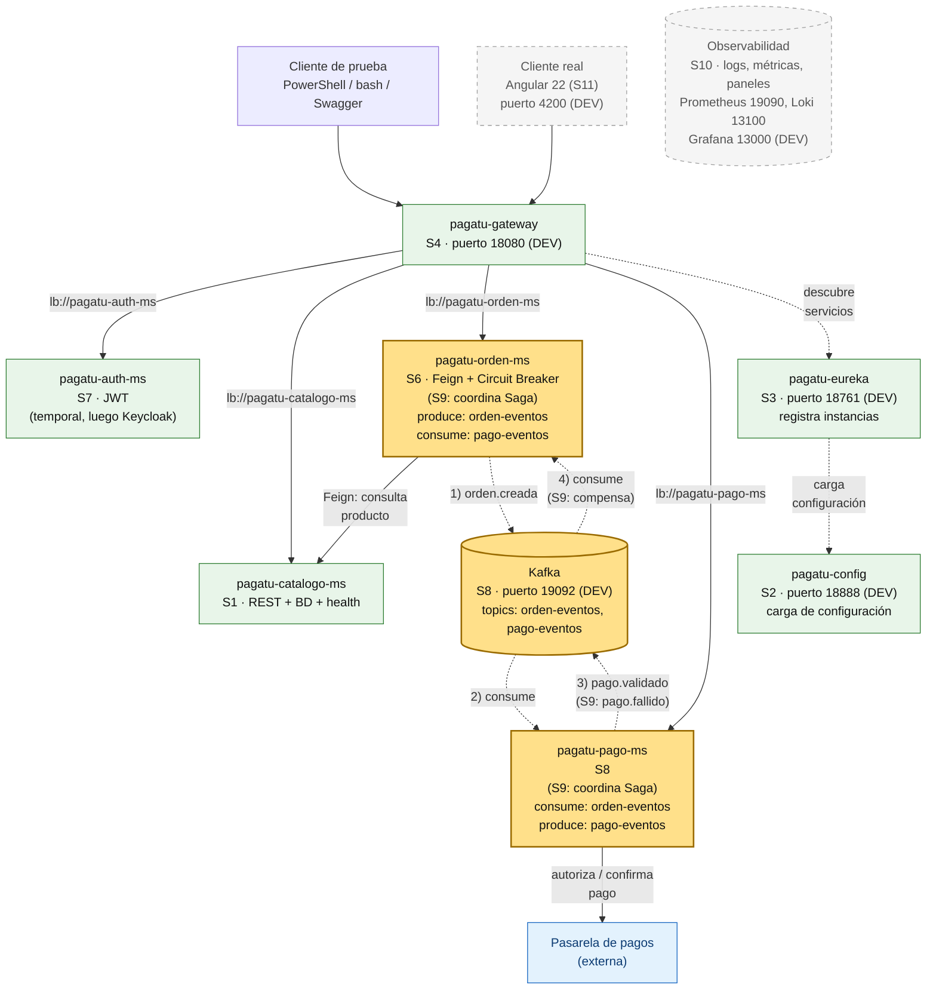
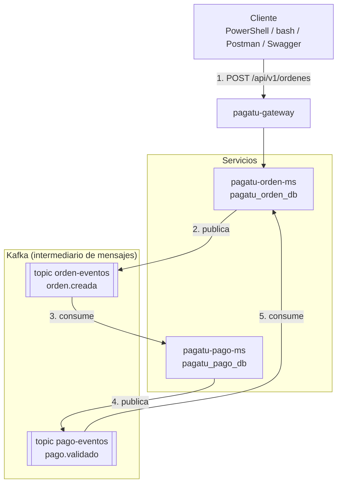
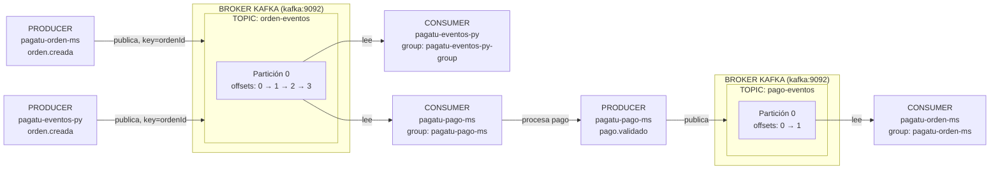
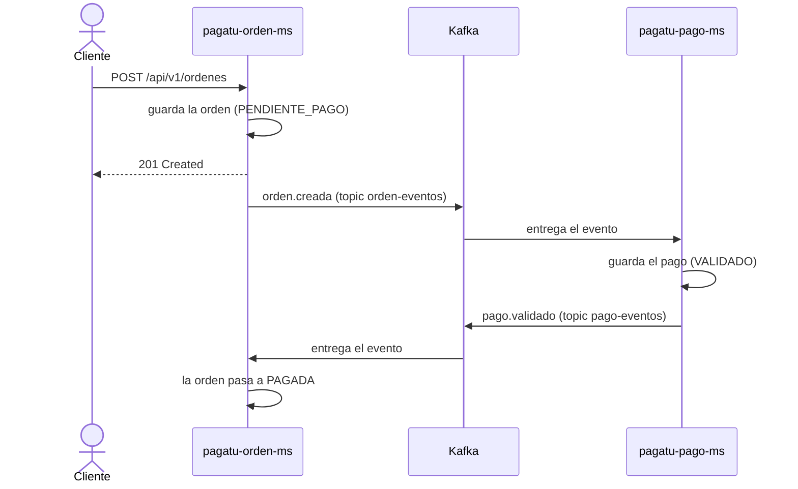

# S8 - Mensajería asíncrona entre servicios

*Por: Angel Sullon Macalupu @asullom - 2026*

## 1. Introducción

Tiempo: 20 min.

### 1.1 Presentación de la sesión

Hasta S7, cuando alguien crea una orden, todo lo que debe ocurrir después depende de que otro servicio responda en ese mismo instante. Cobrar esa orden es un trabajo distinto, más lento y más propenso a fallar que registrarla, y no tiene sentido que quien registra se quede esperando a quien cobra. Esta sesión cambia la forma en que los servicios se hablan: en vez de esperar una respuesta, un servicio **anuncia lo que ocurrió** y otro reacciona cuando puede. Aparece `pagatu-pago-ms`, el servicio que cobra, y entre ambos servicios se instala un intermediario que guarda los avisos hasta que alguien los atienda. El porqué de hacerlo ahora se desarrolla en 1.6, a partir del caso.

### 1.2 Índice

1. Comunicación síncrona y asíncrona entre servicios.
2. Broker de mensajes, topic, productor y consumidor.
3. Evento de negocio y su contrato.
4. Desacople entre servicios y su evidencia.
5. Observabilidad y diagnóstico.

### 1.3 Propósito de aprendizaje

Al concluir la clase, estarás en condiciones de:

- **Implementar** comunicación por eventos entre servicios desacoplados mediante un intermediario de mensajes, publicando y consumiendo un evento de negocio, y **evidenciar** su publicación, su consumo y el desacople entre los servicios.

### 1.4 Producto de sesión

Kafka y Kafka UI corriendo en DEV (desarrollo, puertos `19092` y `18085`) y con su definición para PROD (producción) local (`29092` y `28085`); el topic `orden-eventos` probado manualmente por consola, por Kafka UI y por un productor/consumidor en Python; `pagatu-pago-ms` como cuarto microservicio del proyecto, que consume `orden.creada` del topic `orden-eventos`, publica `pago.validado` en `pago-eventos` y expone `GET /api/v1/pagos`/`GET /api/v1/pagos/{id}` (con Spring Security ya conectado al JWT de `pagatu-auth-ms`, sin exigirlo todavía); `pagatu-orden-ms` publicando `orden.creada` al registrar una orden y consumiendo `pago.validado` para pasarla a `PAGADA`; el contrato de los dos eventos documentado; y la evidencia de que los servicios están desacoplados (con `pagatu-pago-ms` apagado, la orden se registra igual y se paga cuando el servicio vuelve).

### 1.5 Metodología

**Tabla 1. Metodología de la sesión**

| Actividades a Realizar en el Periodo | Orientaciones generales (Orientaciones Metodológicas) | Material de estudio recomendado |
|---|---|---|
| Revisión previa individual | Confirmar que `pagatu-config`, `pagatu-eureka`, `pagatu-gateway`, `pagatu-auth-ms`, `pagatu-catalogo-ms` y `pagatu-orden-ms` (S1-S7) siguen arrancando en DEV, y que puedes crear una orden autenticado como `CLIENTE` (S7, 3.23). Trabajo individual, antes de clase. | Evidencia individual de S7, [Alcance por microservicio y proyecto base](../proyecto-sello/alcance-microservicios.md). |
| Clase presencial | Construcción guiada de `pagatu-pago-ms`, del intermediario Kafka y de los eventos entre `pagatu-orden-ms` y `pagatu-pago-ms`. Trabajo individual, siguiendo al docente paso a paso; consulta inmediata ante un evento que no llega o un servicio que no consume. | Pasos 3.1 a 3.21 de esta guía. |
| Evaluación formativa | Revisión en clase de la orden pasando de `PENDIENTE_PAGO` a `PAGADA` por eventos, y de la prueba de desacople con `pagatu-pago-ms` apagado. La evidencia se completa y sustenta de forma individual, fuera del aula, según los criterios mínimos de la sección 4.4. | Indicaciones de entrega (4.3), rúbrica de evaluación (4.6). |

### 1.6 Motivación de la sesión

#### 1.6.1 Caso: la caja que hizo esperar a todos

En una pizzería, el mozo lleva cada pedido a la caja y espera de pie a que el cajero confirme el pago.

Un sábado el banco tarda. El mozo no puede atender más mesas, y los clientes se van.

Otra pizzería cuelga una comanda: el mozo sigue atendiendo, y el cajero cobra cuando puede. Si el cajero falta un rato, las comandas esperan.

**Preguntas de análisis**

**Activación de conocimientos previos**

1. ¿Qué pasa en un negocio cuando quien atiende debe esperar a otro para poder seguir?
2. En S6, ¿qué hace `pagatu-orden-ms` cuando `pagatu-catalogo-ms` tarda en responder?

**Comprensión de mensajería asíncrona**

1. ¿Qué diferencia hay entre esperar la respuesta de otro servicio y dejarle un aviso?
2. Si el servicio que cobra está apagado, ¿qué debería pasar con los avisos pendientes?

### 1.7 Ubicación en el curso

- Unidad: U2 - Sistema distribuido robusto.
- Producto del curso: Proyecto Sello: sistema distribuido de microservicios end-to-end, configurable, escalable, seguro, resiliente, consistente, observable, integrado con frontend y defendido técnicamente.
- Producto de unidad: sistema distribuido seguro, resiliente, consistente, observable e integrado con cliente frontend.
- Avance del producto en esta sesión: cuarto microservicio del proyecto (`pagatu-pago-ms`) y primera comunicación por eventos, entre `pagatu-orden-ms` y `pagatu-pago-ms`, a través de Kafka.

**Figura 1. Roadmap del producto de la unidad**



*Leyenda.* Este diagrama es el mismo en todas las sesiones de la unidad; solo cambia el color: verde = construido en sesiones anteriores, amarillo = se trabaja hoy, gris punteado = todavía no existe, azul = sistema externo.

`pagatu-cliente-ms` (autónomo desde S2) y su consulta a RENIEC (Registro Nacional de Identificación y Estado Civil) / SUNAT (Superintendencia Nacional de Aduanas y de Administración Tributaria) no se dibujan para mantener legible el diagrama: siguen el mismo patrón de rutas, registro y configuración que los demás microservicios.

**Hoy:** aparecen Kafka y `pagatu-pago-ms`; `pagatu-orden-ms` publica `orden.creada` y consume `pago.validado`, y `pagatu-pago-ms` hace lo inverso. La pasarela de pagos externa se **simula** hoy: el pago siempre se valida. Que el pago pueda fallar, y qué hacer entonces, es el tema de S9.

**Relaciones con la infraestructura** (no se dibujan, para mantener legible el diagrama):

- **`pagatu-config`**: `pagatu-gateway`, `pagatu-eureka` y cada microservicio cargan su configuración desde él al arrancar (S2).
- **`pagatu-eureka`**: cada microservicio se registra en él como instancia (S3), y `pagatu-gateway` lo consulta para descubrir servicios y resolver las rutas `lb://`.

**Aún no existen** (ya están agendados en el sílabo de esta unidad): Saga (S9), Observabilidad (S10) y el cliente Angular (S11).

## 2. Explica

Tiempo: 30 min.

### 2.1 Arquitectura de la sesión

**Figura 2. `pagatu-orden-ms` y `pagatu-pago-ms` se hablan por eventos, a través de Kafka**



Lectura del diagrama: el cliente solo habla con `pagatu-orden-ms`, a través del Gateway. Los pasos 2 a 5 ocurren **sin que el cliente espere**: `pagatu-orden-ms` responde `201` en cuanto registra la orden, y el cobro sucede después, por eventos. Los dos servicios nunca se llaman directamente: cada uno solo conoce a Kafka y el nombre de sus topics. Cada apartado siguiente desarrolla una de estas piezas, en el mismo orden del Índice (1.2).

### 2.2 Comunicación síncrona y asíncrona entre servicios

En una comunicación **síncrona**, quien llama espera la respuesta antes de seguir: `pagatu-orden-ms` consulta un producto a `pagatu-catalogo-ms` por HTTP (*HyperText Transfer Protocol*) con Feign (S6) y no puede continuar hasta recibir el precio. En una comunicación **asíncrona**, quien llama deja un mensaje y sigue con su trabajo; el destinatario lo atiende cuando puede, y la respuesta, si existe, llega después por otro mensaje. La diferencia de fondo es el **acoplamiento temporal**: en la síncrona, los dos servicios deben estar disponibles **al mismo tiempo**; en la asíncrona, no.

**Tabla 2. Comunicación síncrona frente a asíncrona**

| | Síncrona (Feign, S6) | Asíncrona (eventos, hoy) |
|---|---|---|
| Quién espera | Quien llama, hasta recibir la respuesta. | Nadie: quien publica sigue con su trabajo. |
| Si el otro servicio está caído | La llamada falla; hace falta *timeout*, reintentos y *fallback* (S6). | El mensaje espera en el intermediario hasta que el servicio vuelva. |
| Cuándo conviene | Cuando se **necesita el dato ahora** para continuar (el precio del producto para calcular el total). | Cuando solo hay que **avisar lo que ocurrió** y otro trabaja por su cuenta (cobrar una orden ya registrada). |
| Costo | Los servicios quedan atados en el tiempo. | El resultado no es inmediato: la consistencia entre servicios pasa a ser *eventual* (S9). |

**Error frecuente**: pensar que asíncrono significa "más rápido". La orden no se paga antes: se paga **después**, y quien la registró ya no espera por ello. Lo que se gana es independencia entre los servicios, no velocidad de cobro.

### 2.3 Broker de mensajes, topic, productor y consumidor

Un **broker de mensajes** (intermediario de mensajes) es un servicio intermedio que recibe mensajes de quienes los publican y los guarda hasta que quienes los necesitan los lean. **Apache Kafka** es un broker que guarda los mensajes en un registro ordenado y persistente, organizado en *topics* (Apache Software Foundation, 2024). Como el broker guarda los mensajes, publicar y consumir no tienen que ocurrir al mismo tiempo.

**Tabla 3. Conceptos de Kafka de esta sesión**

| Concepto | Qué es | En `pagatu` |
|---|---|---|
| `broker` | El servidor de Kafka que recibe, guarda y entrega los mensajes. | El contenedor `pagatu-kafka-dev` (DEV, puerto `19092`). |
| `topic` | Categoría con nombre a la que se publican los mensajes de un mismo tipo. | `orden-eventos` y `pago-eventos`. |
| `partition` | Cada topic se divide en particiones; dentro de una, los mensajes conservan su orden. | Cada topic tiene 3 particiones. |
| `producer` | Quien publica mensajes en un topic. | `pagatu-orden-ms` en `orden-eventos`; `pagatu-pago-ms` en `pago-eventos`. |
| `consumer` | Quien lee mensajes de un topic. | `pagatu-pago-ms` lee `orden-eventos`; `pagatu-orden-ms` lee `pago-eventos`. |
| `consumer group` | Conjunto de consumidores que se reparten los mensajes de un topic: cada mensaje lo procesa uno solo del grupo. | `pagatu-pago-ms` y `pagatu-orden-ms`, cada uno con su grupo. |
| `offset` | Posición de un mensaje dentro de una partición; el grupo recuerda hasta cuál leyó. | Es lo que permite retomar donde se quedó cuando un servicio vuelve. |
| `key` | Valor que decide en qué partición cae un mensaje: la misma key va siempre a la misma partición. | El `ordenId`: todos los eventos de una orden conservan su orden. |

**Figura 3. Flujo completo: `pagatu-orden-ms` y `pagatu-pago-ms` se escuchan de ida y vuelta**



`pagatu-pago-ms` y `pagatu-eventos-py` (3.6) leen del **mismo** topic (`orden-eventos`) sin competir entre sí porque cada uno tiene su propio *consumer group* — Kafka entrega una copia completa de los mensajes a cada consumer group, no los reparte como si fuera una sola cola compartida. El ciclo se cierra con `pagatu-orden-ms` leyendo de vuelta `pago-eventos`: el mismo servicio es productor de un topic y consumidor del otro, no dos roles separados en dos servicios distintos — así es como la orden pasa de `PENDIENTE_PAGO` a `PAGADA` sin que nadie llame a nadie por HTTP. En la práctica manual (3.3) solo existe `orden-eventos`; `pago-eventos` aparece recién cuando `pagatu-pago-ms` publica su primer `pago.validado` (3.14).

El broker de esta sesión corre en el modo KRaft (*Kafka Raft*), en el que Kafka se coordina por sí mismo, sin un servicio adicional. En Spring, el `producer` se maneja con un `KafkaTemplate` y el `consumer` con la anotación `@KafkaListener` (Spring for Apache Kafka, 2026).

### 2.4 Evento de negocio y su contrato

Un **evento de negocio** es el registro de un hecho que **ya ocurrió** en el negocio, dicho en pasado: `orden.creada`, `pago.validado`. No le pide nada a nadie: informa. Esa es la diferencia con una orden o comando ("cobra esta orden"), que exige una acción y espera un resultado. Fowler (2017) distingue dos usos: el evento como simple **notificación** de un cambio, donde quien lo emite no se ocupa de la respuesta, y el evento que **lleva el estado** suficiente para que el receptor no tenga que consultar de vuelta a quien lo emitió.

Los eventos de `pagatu` hacen lo segundo: `orden.creada` lleva el monto y el método de pago, así que `pagatu-pago-ms` cobra sin llamar a `pagatu-orden-ms`. Si tuviera que consultarla, volvería el acoplamiento que los eventos quieren evitar.

**Tabla 4. Partes de un evento**

| Parte | Para qué sirve | Campo en `pagatu` |
|---|---|---|
| Tipo | Qué ocurrió. El consumidor lo usa para ignorar lo que no le interesa. | `tipoEvento` |
| Identificador del hecho | A qué entidad del negocio se refiere; también es la *key* del mensaje. | `ordenId` |
| Datos | Lo que el consumidor necesita para reaccionar, y no más. | `total`, `metodoPago`, `idCliente`; `monto`, `estado` |
| Origen | Quién lo publicó. | `origen` |
| Momento | Cuándo ocurrió, en milisegundos *epoch*. | `timestamp` |

El **contrato** del evento es el acuerdo entre quien lo publica y quien lo consume sobre esas partes: nombres, tipos y significado, escritos en JSON (*JavaScript Object Notation*). En `pagatu` cada servicio tiene **su propia copia** de las clases del evento, en su paquete `event`: no hay una librería compartida, porque compartirla ataría los dos servicios a la misma versión y volvería a acoplarlos. Lo que los mantiene de acuerdo es el contrato documentado (3.21).

### 2.5 Desacople entre servicios y su evidencia

Dos servicios están **desacoplados** cuando pueden cambiar, fallar o apagarse por separado sin arrastrar al otro. Con eventos, `pagatu-orden-ms` no sabe si `pagatu-pago-ms` existe: solo publica un hecho. Y como Kafka conserva los mensajes, si `pagatu-pago-ms` está apagado, `orden-eventos` acumula los avisos; al volver, el servicio retoma desde su último *offset*. Esa es la evidencia que se pide hoy (3.20): apagar un servicio y comprobar que el otro no se entera.

**Figura 4. Recorrido de una orden pagada, de punta a punta**



Dos decisiones del código de hoy merecen explicación, porque son las que evitan errores sutiles:

- **Se publica después de guardar, no antes.** El evento se envía solo cuando la transacción de la base de datos ya se confirmó (`afterCommit`). Si se publicara antes y el guardado fallara, el resto del sistema se enteraría de una orden que no existe.
- **La *key* es el `ordenId`.** Kafka garantiza el orden solo dentro de una partición; con esa *key*, todos los eventos de una orden caen en la misma y se leen en el orden en que se publicaron.

Y una limitación que hoy **no** se resuelve, a propósito: Kafka entrega cada mensaje **al menos una vez**, así que un evento podría llegar dos veces, y si la publicación falla después de guardar, el evento se pierde y la orden queda en `PENDIENTE_PAGO`. Tratar esos casos (eventos duplicados, compensación, consistencia) es el tema de S9.

### 2.6 Observabilidad y diagnóstico

Cuando un evento "no llega", el problema puede estar en tres lugares, y conviene mirarlos en este orden:

1. **El productor no publicó.** Busca en el log del servicio que publica la línea `component=producer ... status=published`, con su `partition` y su `offset`. Si aparece `status=error`, el problema es la conexión con Kafka.
2. **El mensaje no está en el topic.** En Kafka UI (`http://localhost:18085`), abre el topic y confirma que el mensaje existe, con su contenido.
3. **El consumidor no lo procesó.** En Kafka UI, en *Consumers*, el grupo del servicio muestra su *lag*: cuántos mensajes le faltan por leer. Un *lag* que no baja indica un consumidor caído; en el log del consumidor, busca `component=consumer ... status=consumed`.

Los logs de `pagatu-orden-ms` y `pagatu-pago-ms` usan el mismo formato (`component`, `eventType`, `ordenId`, `status`), para que un mismo `ordenId` se pueda seguir de un servicio a otro. La observabilidad completa (métricas y paneles) llega en S10.

## 3. Aplica: actividad práctica guiada

Tiempo: 4h.

**Actividad:** construcción guiada de la mensajería entre servicios: Kafka en DEV, el microservicio `pagatu-pago-ms`, y los eventos `orden.creada` y `pago.validado` entre `pagatu-orden-ms` y `pagatu-pago-ms`, con la evidencia de desacople (Producto de la sesión en 1.4).

**Propósito de la actividad:** que cada estudiante implemente, de punta a punta y con evidencia real, una comunicación por eventos entre dos servicios desacoplados: publicar, consumir, y comprobar qué pasa cuando uno de los dos no está.

**Orientaciones metodológicas:** en el laboratorio, el docente construye la sesión en orden frente a la clase — primero Kafka, sus tres pruebas rápidas y `pagatu-pago-ms` (3.2 a 3.16), después los cambios en `pagatu-orden-ms` (3.17 y 3.18), al final las pruebas (3.19 y 3.20) —; los estudiantes replican cada paso en su propio equipo y provocan ellos mismos la prueba de desacople para ver en su propia consola y en Kafka UI qué pasa con los mensajes pendientes.

**Actividades para realizar:**

- **3.1** Verificar el punto de partida.
- **3.2** Levantar Kafka y Kafka UI.
- **3.3** Probar Kafka por consola.
- **3.4** Verificar con Kafka UI.
- **3.5** Probar el contrato del evento desde Kafka UI.
- **3.6** Probar con Python (uso rápido).
- **3.7** Levantar la base de datos de `pagatu-pago-ms`.
- **3.8** Crear el proyecto base de `pagatu-pago-ms`.
- **3.9** Crear el manejador de errores y el filtro de trazabilidad.
- **3.10** Conectar `pagatu-pago-ms` a `pagatu-config` y a `pagatu-eureka`, y crear su migración.
- **3.11** Configurar `pagatu-pago-ms` en `config-repo`.
- **3.12** Crear la entidad `Pago` y su repositorio.
- **3.13** Crear el contrato de los eventos en `pagatu-pago-ms`.
- **3.14** Consumir `orden.creada` y publicar `pago.validado`.
- **3.15** Exponer el listado de pagos.
- **3.16** Levantar `pagatu-pago-ms` y comprobar que escucha.
- **3.17** Publicar `orden.creada` desde `pagatu-orden-ms`.
- **3.18** Consumir `pago.validado` en `pagatu-orden-ms`.
- **3.19** Probar de punta a punta.
- **3.20** Probar el desacople.
- **3.21** Documentar el contrato de los eventos.

**Punto de partida común:** todo el equipo debe comenzar exactamente desde donde quedó S7 (seguridad distribuida), no desde su propio avance individual. Clona la rama `s07-seguridad-jwt`:

```bash
git clone --branch s07-seguridad-jwt https://github.com/262dist/pagatu.git
```

### 3.1 Verificar el punto de partida

**Producto del paso:** los servicios de S7 corriendo, y un token de `CLIENTE` listo para crear órdenes.

Levanta en DEV, cada uno en su terminal, `pagatu-config`, `pagatu-eureka`, `pagatu-gateway`, `pagatu-auth-ms`, `pagatu-catalogo-ms` y `pagatu-orden-ms`, con sus bases de datos (`compose-dev.yml` de cada servicio). Si alguno falla en arrancar, el problema es de una sesión anterior, no de esta.

Obtén el token de `cliente@pagatu.com` a través del Gateway y guárdalo en una variable (la usas en 3.19 y 3.20):

PowerShell:

```powershell
$login = Invoke-RestMethod -Method Post -Uri "http://localhost:18080/api/v1/auth/login" `
  -ContentType "application/json" `
  -Body '{"email": "cliente@pagatu.com", "password": "cliente123"}'
$tokenCliente = $login.access_token
```

bash macOS/Linux (requiere `jq`):

```bash
TOKEN_CLIENTE=$(curl -s -X POST http://localhost:18080/api/v1/auth/login \
  -H "Content-Type: application/json" \
  -d '{"email": "cliente@pagatu.com", "password": "cliente123"}' | jq -r '.access_token')
```

### 3.2 Levantar Kafka y Kafka UI

**Producto del paso:** el broker y su interfaz web corriendo en DEV, y su definición para PROD local lista.

Kafka vive en su propia carpeta, `kafka/`, separada de los servicios, porque lo usan varios. Los puertos siguen el criterio del proyecto: prefijo `1` para DEV y `2` para PROD local.

**`kafka/compose-dev.yml`:**

```yaml
name: pagatu-kafka-dev

services:
  kafka:
    image: apache/kafka:4.3.1
    container_name: pagatu-kafka-dev
    restart: unless-stopped
    ports:
      - "19092:19092"
    environment:
      KAFKA_NODE_ID: 1
      KAFKA_PROCESS_ROLES: broker,controller
      KAFKA_LISTENERS: INTERNAL://0.0.0.0:9092,EXTERNAL://0.0.0.0:19092,CONTROLLER://0.0.0.0:9093
      KAFKA_ADVERTISED_LISTENERS: INTERNAL://kafka:9092,EXTERNAL://localhost:19092
      KAFKA_LISTENER_SECURITY_PROTOCOL_MAP: INTERNAL:PLAINTEXT,EXTERNAL:PLAINTEXT,CONTROLLER:PLAINTEXT
      KAFKA_INTER_BROKER_LISTENER_NAME: INTERNAL
      KAFKA_CONTROLLER_LISTENER_NAMES: CONTROLLER
      KAFKA_CONTROLLER_QUORUM_VOTERS: 1@kafka:9093
      KAFKA_OFFSETS_TOPIC_REPLICATION_FACTOR: 1
      KAFKA_GROUP_INITIAL_REBALANCE_DELAY_MS: 0
      KAFKA_AUTO_CREATE_TOPICS_ENABLE: "false"
    networks:
      pagatu-kafka-dev-net:
        aliases:
          - kafka

  kafka-ui:
    image: ghcr.io/kafbat/kafka-ui:v1.5.0
    container_name: pagatu-kafka-ui-dev
    restart: unless-stopped
    ports:
      - "18085:8080"
    depends_on:
      - kafka
    environment:
      KAFKA_CLUSTERS_0_NAME: pagatu-dev
      KAFKA_CLUSTERS_0_BOOTSTRAPSERVERS: kafka:9092
    networks:
      - pagatu-kafka-dev-net

networks:
  pagatu-kafka-dev-net:
    name: pagatu-kafka-dev-net
```

El broker tiene **dos** direcciones de escucha, y es lo que más confunde: `INTERNAL` (`kafka:9092`) es la que usan otros contenedores, como Kafka UI; `EXTERNAL` (`localhost:19092`) es la que usan los servicios Spring Boot que corren en tu máquina con `mvnw` (`bootstrap-servers` de 3.11). Cada cliente se conecta a la dirección que el broker le **anuncia**, por eso `KAFKA_ADVERTISED_LISTENERS` declara las dos.

`KAFKA_AUTO_CREATE_TOPICS_ENABLE: "false"` es intencional: cada topic se crea de forma explícita (3.3, 3.14), con las particiones que decides — no aparece solo la primera vez que alguien publica en un nombre nuevo, un error común que oculta un typo en el nombre del topic detrás de un topic "fantasma" con una sola partición por defecto, en vez de las 3 que espera el código (3.14).

**`kafka/compose.yml`:**

```yaml
name: pagatu-kafka-prod

services:
  pagatu-kafka:
    image: apache/kafka:4.3.1
    container_name: pagatu-kafka
    restart: unless-stopped
    ports:
      - "29092:29092"
    environment:
      KAFKA_NODE_ID: 1
      KAFKA_PROCESS_ROLES: broker,controller
      KAFKA_LISTENERS: INTERNAL://0.0.0.0:9092,EXTERNAL://0.0.0.0:29092,CONTROLLER://0.0.0.0:9093
      KAFKA_ADVERTISED_LISTENERS: INTERNAL://pagatu-kafka:9092,EXTERNAL://localhost:29092
      KAFKA_LISTENER_SECURITY_PROTOCOL_MAP: INTERNAL:PLAINTEXT,EXTERNAL:PLAINTEXT,CONTROLLER:PLAINTEXT
      KAFKA_INTER_BROKER_LISTENER_NAME: INTERNAL
      KAFKA_CONTROLLER_LISTENER_NAMES: CONTROLLER
      KAFKA_CONTROLLER_QUORUM_VOTERS: 1@pagatu-kafka:9093
      KAFKA_OFFSETS_TOPIC_REPLICATION_FACTOR: 1
      KAFKA_GROUP_INITIAL_REBALANCE_DELAY_MS: 0
      KAFKA_AUTO_CREATE_TOPICS_ENABLE: "false"
    networks:
      - pagatu-prod-net

  pagatu-kafka-ui:
    image: ghcr.io/kafbat/kafka-ui:v1.5.0
    container_name: pagatu-kafka-ui
    restart: unless-stopped
    ports:
      - "28085:8080"
    depends_on:
      - pagatu-kafka
    environment:
      KAFKA_CLUSTERS_0_NAME: pagatu-prod
      KAFKA_CLUSTERS_0_BOOTSTRAPSERVERS: pagatu-kafka:9092
    networks:
      - pagatu-prod-net

networks:
  pagatu-prod-net:
    external: true
    name: pagatu-prod-net
```

La definición de PROD local usa los puertos `29092` y `28085`, se une a la red `pagatu-prod-net` de `infra/` (creada por su `compose.yml`) y anuncia el broker por el nombre del contenedor, `pagatu-kafka:9092`. Hoy no se levanta: queda lista, igual que los demás archivos de PROD.

Levanta Kafka en DEV:

```bash
cd kafka
docker compose -f compose-dev.yml up -d
```

Abre `http://localhost:18085`: Kafka UI debe mostrar el clúster `pagatu-dev` en línea, sin ningún topic todavía.

### 3.3 Probar Kafka por consola

**Producto del paso:** el topic `orden-eventos` creado a mano, con las mismas 3 particiones que declarará el código en 3.14, y probado con un producer y un consumer manuales.

Entra al contenedor:

```powershell
docker compose -f kafka/compose-dev.yml exec kafka bash
```

Crea el topic, ya con las 3 particiones que `pagatu-pago-ms` declarará en su código (3.14) — si lo creas con menos, Spring no las corrige después, solo usa el topic tal como está:

```bash
/opt/kafka/bin/kafka-topics.sh --create \
  --topic orden-eventos \
  --bootstrap-server kafka:9092 \
  --partitions 3 \
  --replication-factor 1
```

Lista los topics:

```bash
/opt/kafka/bin/kafka-topics.sh --list --bootstrap-server kafka:9092
```

Resultado esperado:

```text
orden-eventos
```

**Terminal 1** (consumer):

```powershell
docker compose -f kafka/compose-dev.yml exec kafka bash
```

```bash
/opt/kafka/bin/kafka-console-consumer.sh \
  --topic orden-eventos \
  --bootstrap-server kafka:9092 \
  --from-beginning
```

**Terminal 2** (producer):

```powershell
docker compose -f kafka/compose-dev.yml exec kafka bash
```

```bash
/opt/kafka/bin/kafka-console-producer.sh \
  --topic orden-eventos \
  --bootstrap-server kafka:9092
```

Escribe:

```text
hola kafka
```

El consumer de la Terminal 1 debe mostrar ese mismo texto de inmediato.

Nota el `--bootstrap-server kafka:9092`, no `localhost:19092`: dentro del contenedor usas la dirección `INTERNAL` (3.2), la misma que usa Kafka UI; `localhost:19092` (`EXTERNAL`) es solo para clientes que corren fuera de Docker, como `pagatu-pago-ms` (3.11) más adelante.

**Error frecuente**: crear el topic sin `--partitions 3` (o dejar que se autocree al publicar, si `KAFKA_AUTO_CREATE_TOPICS_ENABLE` estuviera en `true`). Con una sola partición, `pagatu-pago-ms` arranca igual en 3.16, pero el topic se queda con 1 partición para siempre: Spring solo pide crear el topic si no existe, nunca cambia las particiones de uno que ya existe. Bórralo (`--delete`) y créalo de nuevo con `--partitions 3` si esto pasa.

### 3.4 Verificar con Kafka UI

**Producto del paso:** confirmación visual del topic, sus mensajes y sus offsets.

Abre `http://localhost:18085` y verifica:

- El clúster `pagatu-dev` aparece conectado.
- El topic `orden-eventos` existe, con 3 particiones.
- El mensaje manual de 3.3 aparece en la pestaña de mensajes, con columnas `partition` y `offset`.

### 3.5 Probar el contrato del evento desde Kafka UI

**Producto del paso:** confirmación de que un mensaje con la forma real de `orden.creada` (2.4) se puede publicar y leer, antes de escribir ninguna clase Java para eso.

El productor y el consumidor de consola de 3.3 mueven **texto**, no el evento real: sirven para probar que Kafka funciona, no para probar el contrato. Kafka UI, además de mostrar mensajes, puede publicarlos: en el topic `orden-eventos`, busca la opción para producir un mensaje (normalmente un botón "Produce Message" en la vista del topic) y publica este valor, con la *key* `321`:

```json
{
  "tipoEvento": "orden.creada",
  "ordenId": 321,
  "idCliente": 7,
  "total": 180.00,
  "metodoPago": "TARJETA",
  "origen": "kafka-ui",
  "timestamp": 1713350000000
}
```

Es exactamente la forma de `OrdenCreadaEvento` (3.13, 3.17): los mismos siete campos, en el mismo orden en que `pagatu-pago-ms` los va a esperar. Confirma que el mensaje aparece en la pestaña de mensajes de Kafka UI, y en la Terminal 1 de 3.3 (si el consumer de consola sigue abierto) — ahí se ve como texto JSON plano, porque un consumer de consola no lo deserializa a ninguna clase.

**Error frecuente**: pegar el JSON con una coma de más o una comilla sin cerrar. Kafka UI no valida que el valor sea JSON — lo publica igual, como texto — así que el error no aparece ahora, sino después, cuando `pagatu-pago-ms` (3.16) lo reciba y el `ErrorHandlingDeserializer` (3.11) lo marque como inválido en el log.

### 3.6 Probar con Python (uso rápido)

**Producto del paso:** el mismo evento `orden.creada` publicado y consumido, ahora con un cliente distinto al de consola y al de Kafka UI — un productor y un consumidor reales en Python, en bucle, para confirmar que el flujo aguanta tráfico continuo antes de escribir la primera línea de `pagatu-pago-ms`.

Los pasos 3.3 a 3.5 prueban Kafka de a un mensaje a la vez, escrito a mano. `uso-rapido/pagatu-eventos-py/` es un contenedor Python independiente, sin ningún puerto expuesto (no es un servicio con el que hable nada más que Kafka), con un productor que publica un evento cada 2 segundos en bucle y un consumidor que los procesa y registra en el mismo formato de log (`component`, `eventType`, `ordenId`, `status`) que usarán después `pagatu-pago-ms` (3.14) y `pagatu-orden-ms` (3.17).

```powershell
cd uso-rapido/pagatu-eventos-py
docker compose up -d --build
docker compose ps
```

Contenedor esperado:

```text
pagatu-eventos-py
```

Corre el consumidor primero (queda escuchando; se detiene con `Ctrl+C`):

```powershell
docker compose exec pagatu-eventos-py python /app/consumer_ordenes.py
```

En **otra terminal**, corre el productor (publica un evento cada 2 segundos, en bucle infinito; también se detiene con `Ctrl+C`):

```powershell
docker compose exec pagatu-eventos-py python /app/producer_ordenes.py
```

El consumidor debe imprimir una línea JSON por evento, con `topic`/`partition`/`offset` reales del mismo topic `orden-eventos` de 3.3, `idCliente` y `metodoPago` (no `estado`: ese campo no existe en el contrato de `pagatu`, a diferencia de otros cursos) y `status: "consumed"`. Publica también, desde otra terminal, texto plano en el topic (el mismo `kafka-console-producer.sh` de 3.3, o el JSON de 3.5 con una coma de más): el consumidor no debe caerse, debe marcarlo `status: "invalid"` y exponer `rawPayload`/`decodeError` — un consumidor real convive con mensajes que no controla, y ya se está preparando el mismo criterio que usará `ErrorHandlingDeserializer` en `pagatu-pago-ms` (3.11).

**Error frecuente**: el contenedor no arranca, con un error de red al unirse a `pagatu-kafka-dev-net`. Kafka (3.2) tiene que estar levantado primero — esta red la crea `kafka/compose-dev.yml`, no este `compose.yml`, que solo se conecta a ella como red externa.

### 3.7 Levantar la base de datos de `pagatu-pago-ms`

**Producto del paso:** PostgreSQL de `pagatu-pago-ms` corriendo en DEV.

**`services/pagatu-pago-ms/compose-dev.yml`:**

```yaml
name: pagatu-pago-dev

services:
  postgres-pago-dev:
    image: postgres:16-alpine
    container_name: pagatu-postgres-pago-dev
    restart: unless-stopped
    environment:
      POSTGRES_DB: pagatu_pago_db
      POSTGRES_USER: pagatu
      POSTGRES_PASSWORD: pagatu
    ports:
      - "15435:5432"
    volumes:
      - pagatu_pago_dev_data:/var/lib/postgresql/data

volumes:
  pagatu_pago_dev_data:
```

El puerto `15435` y el nombre `pagatu_pago_db` siguen la convención del proyecto (`15431` auth, `15434` orden). El puerto de aplicación en DEV es `8086`, el siguiente libre después de `8085` (`pagatu-auth-ms`, S7).

```bash
cd services/pagatu-pago-ms
docker compose -f compose-dev.yml up -d
```

Comprueba que la base de datos está lista:

```bash
docker exec -it pagatu-postgres-pago-dev psql -U pagatu -d pagatu_pago_db -c "SELECT current_database();"
```

Resultado esperado: `pagatu_pago_db`.

### 3.8 Crear el proyecto base de `pagatu-pago-ms`

**Producto del paso:** proyecto `pagatu-pago-ms` creado, con las mismas dependencias base que `pagatu-orden-ms` más Kafka.

**Tabla 5. Configuración de `pagatu-pago-ms` en Spring Initializr**

| Campo | Valor |
|---|---|
| Project | Maven Project |
| Spring Boot | **4.1.1** |
| Language | Java |
| Group Id | `pe.edu.upeu` |
| Artifact Id | `pagatu-pago-ms` |
| Package name | `pe.edu.upeu.pago` |
| Packaging | Jar |
| Java | 21 |
| Dependencias | Spring Web, Validation, Lombok, Spring Boot DevTools, SpringDoc OpenAPI WebMvc UI, Spring Boot Actuator, Spring Data JPA, PostgreSQL Driver, Flyway, **Prometheus** (categoría *Observability*), **Config Client** y **Eureka Discovery Client** (categorías *Spring Cloud Config* y *Spring Cloud Discovery*), **Spring for Apache Kafka** (categoría *Messaging*) y **OAuth2 Resource Server** (categoría *Security*) — las mismas de `pagatu-orden-ms` (S6, S7) más Kafka, nueva hoy. **Además**, agrega MapStruct a mano en el `pom.xml`, igual que en S7 (3.1): Spring Initializr no lo ofrece como opción. |
| Ubicación sugerida | `services/pagatu-pago-ms` |

`pagatu-pago-ms` no lleva Feign ni Resilience4j: no hace ninguna llamada síncrona a otro servicio que resguardar. Sí lleva **OAuth2 Resource Server** (el mismo JWT de `pagatu-auth-ms`, S7), porque hoy agrega su primer endpoint de negocio (3.13, listar pagos) — mismo criterio que `pagatu-orden-ms`: solo lleva Spring Security el servicio que expone algo que proteger. Al marcar **Spring for Apache Kafka**, Spring Initializr agrega esta dependencia al `pom.xml`, y su versión la gestiona el padre `spring-boot-starter-parent`:

```xml
<dependency>
    <groupId>org.springframework.boot</groupId>
    <artifactId>spring-boot-starter-kafka</artifactId>
</dependency>
```

**OAuth2 Resource Server** agrega esta otra, la misma que usa `pagatu-orden-ms` desde S7:

```xml
<dependency>
    <groupId>org.springframework.boot</groupId>
    <artifactId>spring-boot-starter-security-oauth2-resource-server</artifactId>
</dependency>
```

Config Client y Eureka Discovery Client se marcan aquí, desde el inicio, con la propiedad `<spring-cloud.version>` y el `<dependencyManagement>` que Spring Initializr genera por su cuenta. Ubica el proyecto en `services/pagatu-pago-ms`.

### 3.9 Crear el manejador de errores y el filtro de trazabilidad

**Producto del paso:** `pagatu-pago-ms` con el mismo manejo de errores y la misma trazabilidad por petición que `pagatu-catalogo-ms` (S1) y `pagatu-orden-ms` (S6).

Son una **copia** de las de `pagatu-orden-ms` (`exception/`, `filter/` y `logback-spring.xml`); solo cambia el nombre del artefacto: el paquete `pe.edu.upeu.orden` pasa a `pe.edu.upeu.pago`, y el archivo de log, de `orden.log` a `pago.log`.

**`services/pagatu-pago-ms/src/main/java/pe/edu/upeu/pago/exception/ResourceNotFoundException.java`:**

```java
package pe.edu.upeu.pago.exception;

public class ResourceNotFoundException extends RuntimeException {
    public ResourceNotFoundException(String mensaje) {
        super(mensaje);
    }
}
```

**`services/pagatu-pago-ms/src/main/java/pe/edu/upeu/pago/exception/GlobalExceptionHandler.java`:**

```java
package pe.edu.upeu.pago.exception;

import org.springframework.http.HttpStatus;
import org.springframework.http.ResponseEntity;
import org.springframework.web.bind.MethodArgumentNotValidException;
import org.springframework.web.bind.annotation.ExceptionHandler;
import org.springframework.web.bind.annotation.RestControllerAdvice;

import java.time.Instant;
import java.util.HashMap;
import java.util.Map;

@RestControllerAdvice
public class GlobalExceptionHandler {

    @ExceptionHandler(ResourceNotFoundException.class)
    public ResponseEntity<Map<String, Object>> handleNotFound(ResourceNotFoundException ex) {
        Map<String, Object> body = new HashMap<>();
        body.put("timestamp", Instant.now().toString());
        body.put("status", HttpStatus.NOT_FOUND.value());
        body.put("error", "Not Found");
        body.put("message", ex.getMessage());
        return ResponseEntity.status(HttpStatus.NOT_FOUND).body(body);
    }

    @ExceptionHandler(MethodArgumentNotValidException.class)
    public ResponseEntity<Map<String, Object>> handleValidation(MethodArgumentNotValidException ex) {
        Map<String, Object> body = new HashMap<>();
        body.put("timestamp", Instant.now().toString());
        body.put("status", HttpStatus.BAD_REQUEST.value());
        body.put("error", "Bad Request");
        body.put("message", "Error de validación en los datos enviados");
        return ResponseEntity.status(HttpStatus.BAD_REQUEST).body(body);
    }

    @ExceptionHandler(IllegalArgumentException.class)
    public ResponseEntity<Map<String, Object>> handleIllegalArgument(IllegalArgumentException ex) {
        Map<String, Object> body = new HashMap<>();
        body.put("timestamp", Instant.now().toString());
        body.put("status", HttpStatus.BAD_REQUEST.value());
        body.put("error", "Bad Request");
        body.put("message", ex.getMessage());
        return ResponseEntity.status(HttpStatus.BAD_REQUEST).body(body);
    }
}
```

**`services/pagatu-pago-ms/src/main/java/pe/edu/upeu/pago/filter/CorrelationIdFilter.java`:**

```java
package pe.edu.upeu.pago.filter;

import jakarta.servlet.FilterChain;
import jakarta.servlet.ServletException;
import jakarta.servlet.http.HttpServletRequest;
import jakarta.servlet.http.HttpServletResponse;
import org.slf4j.MDC;
import org.springframework.stereotype.Component;
import org.springframework.web.filter.OncePerRequestFilter;

import java.io.IOException;
import java.util.UUID;

@Component
public class CorrelationIdFilter extends OncePerRequestFilter {

    public static final String TRACE_ID_HEADER = "X-Trace-ID";
    public static final String MDC_KEY = "traceId";

    @Override
    protected void doFilterInternal(HttpServletRequest request,
                                     HttpServletResponse response,
                                     FilterChain filterChain) throws ServletException, IOException {
        String traceId = request.getHeader(TRACE_ID_HEADER);
        if (traceId == null || traceId.isBlank()) {
            traceId = UUID.randomUUID().toString();
        }
        try {
            MDC.put(MDC_KEY, traceId);
            response.setHeader(TRACE_ID_HEADER, traceId);
            filterChain.doFilter(request, response);
        } finally {
            MDC.remove(MDC_KEY);
        }
    }
}
```

**`services/pagatu-pago-ms/src/main/resources/logback-spring.xml`:**

```xml
<?xml version="1.0" encoding="UTF-8"?>
<configuration>
    <include resource="org/springframework/boot/logging/logback/defaults.xml"/>

    <property name="LOG_PATTERN"
              value="%d{yyyy-MM-dd HH:mm:ss.SSS} [%X{traceId}] %-5level %logger{36} - %msg%n"/>

    <appender name="CONSOLE" class="ch.qos.logback.core.ConsoleAppender">
        <encoder>
            <pattern>${LOG_PATTERN}</pattern>
        </encoder>
    </appender>

    <appender name="FILE" class="ch.qos.logback.core.rolling.RollingFileAppender">
        <file>logs/pago.log</file>
        <encoder>
            <pattern>${LOG_PATTERN}</pattern>
        </encoder>
        <rollingPolicy class="ch.qos.logback.core.rolling.TimeBasedRollingPolicy">
            <fileNamePattern>logs/pago-%d{yyyy-MM-dd}.log</fileNamePattern>
            <maxHistory>7</maxHistory>
        </rollingPolicy>
    </appender>

    <root level="INFO">
        <appender-ref ref="CONSOLE"/>
        <appender-ref ref="FILE"/>
    </root>
</configuration>
```

### 3.10 Conectar `pagatu-pago-ms` a `pagatu-config` y a `pagatu-eureka`, y crear su migración

**Producto del paso:** `pagatu-pago-ms` que trae su configuración de `pagatu-config`, se registra en `pagatu-eureka` y tiene su tabla de pagos.

**`services/pagatu-pago-ms/src/main/resources/application.yml`:**

```yaml
spring:
  application:
    name: pagatu-pago-ms
  profiles:
    active: dev
  config:
    import: "optional:configserver:${CONFIG_SERVER_URL:http://localhost:18888}"
```

Mismo patrón exacto que `pagatu-orden-ms` desde S6. Ahora la migración de Flyway con la tabla `pagos`:

**`services/pagatu-pago-ms/src/main/resources/db/migration/V1__create_pagos.sql`:**

```sql
CREATE TABLE IF NOT EXISTS pagos (
    id BIGINT GENERATED BY DEFAULT AS IDENTITY,
    orden_id BIGINT NOT NULL,
    monto NUMERIC(12, 2) NOT NULL,
    metodo_pago VARCHAR(20) NOT NULL,
    estado VARCHAR(20) NOT NULL,
    fecha_pago TIMESTAMP NOT NULL,
    PRIMARY KEY (id),
    CONSTRAINT uk_pagos_orden UNIQUE (orden_id)
);
```

`orden_id` es `UNIQUE`: una orden se paga una sola vez. No es una llave foránea, porque la orden vive en **otra** base de datos (la de `pagatu-orden-ms`); `pagatu-pago-ms` solo guarda su número.

### 3.11 Configurar `pagatu-pago-ms` en `config-repo`

**Producto del paso:** los archivos de configuración DEV y PROD de `pagatu-pago-ms`, con la conexión a Kafka.

**`infra/pagatu-config/config-repo/pagatu-pago-ms-dev.yml`:**

```yaml
server:
  port: 8086

spring:
  security:
    oauth2:
      resourceserver:
        jwt:
          jwk-set-uri: http://localhost:8085/.well-known/jwks.json
  datasource:
    url: jdbc:postgresql://localhost:15435/pagatu_pago_db
    username: pagatu
    password: pagatu
    driver-class-name: org.postgresql.Driver
  flyway:
    enabled: true
    locations: classpath:db/migration
  jpa:
    hibernate:
      ddl-auto: validate
    show-sql: true
    properties:
      hibernate:
        format_sql: true
  devtools:
    restart:
      enabled: true
    livereload:
      enabled: true
  kafka:
    bootstrap-servers: localhost:19092
    producer:
      key-serializer: org.apache.kafka.common.serialization.StringSerializer
      value-serializer: org.springframework.kafka.support.serializer.JacksonJsonSerializer
      properties:
        spring.json.add.type.headers: false
    consumer:
      group-id: pagatu-pago-ms
      auto-offset-reset: earliest
      key-deserializer: org.apache.kafka.common.serialization.StringDeserializer
      value-deserializer: org.springframework.kafka.support.serializer.ErrorHandlingDeserializer
      properties:
        spring.deserializer.value.delegate.class: org.springframework.kafka.support.serializer.JacksonJsonDeserializer
        spring.json.value.default.type: pe.edu.upeu.pago.event.OrdenCreadaEvento
        spring.json.trusted.packages: pe.edu.upeu.pago.event
        spring.json.use.type.headers: false

app:
  kafka:
    topic:
      ordenes: orden-eventos
      pagos: pago-eventos

logging:
  level:
    pe.edu.upeu.pago: DEBUG

management:
  endpoints:
    web:
      exposure:
        include: health,info,metrics,prometheus
  endpoint:
    health:
      show-details: always

eureka:
  instance:
    hostname: localhost
    instance-id: ${spring.application.name}:${server.port}
  client:
    service-url:
      defaultZone: http://localhost:18761/eureka
```

**`infra/pagatu-config/config-repo/pagatu-pago-ms-prod.yml`:**

```yaml
server:
  port: 8080

spring:
  security:
    oauth2:
      resourceserver:
        jwt:
          jwk-set-uri: http://pagatu-auth-ms:8080/.well-known/jwks.json
  datasource:
    url: jdbc:postgresql://${DB_HOST}:${DB_PORT}/${DB_NAME}
    username: ${DB_USER}
    password: ${DB_PASS}
    driver-class-name: org.postgresql.Driver
  flyway:
    enabled: true
    locations: classpath:db/migration
  jpa:
    hibernate:
      ddl-auto: validate
    show-sql: false
    properties:
      hibernate:
        format_sql: false
  kafka:
    bootstrap-servers: pagatu-kafka:9092
    producer:
      key-serializer: org.apache.kafka.common.serialization.StringSerializer
      value-serializer: org.springframework.kafka.support.serializer.JacksonJsonSerializer
      properties:
        spring.json.add.type.headers: false
    consumer:
      group-id: pagatu-pago-ms
      auto-offset-reset: earliest
      key-deserializer: org.apache.kafka.common.serialization.StringDeserializer
      value-deserializer: org.springframework.kafka.support.serializer.ErrorHandlingDeserializer
      properties:
        spring.deserializer.value.delegate.class: org.springframework.kafka.support.serializer.JacksonJsonDeserializer
        spring.json.value.default.type: pe.edu.upeu.pago.event.OrdenCreadaEvento
        spring.json.trusted.packages: pe.edu.upeu.pago.event
        spring.json.use.type.headers: false

app:
  kafka:
    topic:
      ordenes: orden-eventos
      pagos: pago-eventos

management:
  endpoints:
    web:
      exposure:
        include: health,info,metrics,prometheus
  endpoint:
    health:
      show-details: never

eureka:
  instance:
    instance-id: ${spring.application.name}:${random.value}
  client:
    service-url:
      defaultZone: http://pagatu-eureka:8761/eureka
```

`spring.security.oauth2.resourceserver.jwt.jwk-set-uri` es el mismo bloque de `pagatu-orden-ms` (S7): apunta a las claves públicas de `pagatu-auth-ms` para validar la firma del JWT — en DEV, su dirección en el host (`localhost:8085`); en PROD local, el nombre del contenedor (`pagatu-auth-ms:8080`). El endpoint de 3.15 todavía no lo exige (`permitAll`), pero la configuración ya queda lista para cuando se active.

El bloque `spring.kafka` es el que convierte al servicio en productor y consumidor, sin escribir ninguna clase de configuración:

- `bootstrap-servers`: dónde está el broker. En DEV, la dirección `EXTERNAL` de 3.2 (`localhost:19092`); en PROD local, el nombre del contenedor (`pagatu-kafka:9092`).
- `producer`: la *key* es texto y el valor se serializa a JSON con `JacksonJsonSerializer`. `spring.json.add.type.headers: false` evita que el mensaje lleve el nombre de la clase Java del emisor: el consumidor no debe depender de ella.
- `consumer.group-id`: el grupo de consumidores de este servicio. `auto-offset-reset: earliest` hace que un grupo nuevo lea desde el principio del topic en vez de perderse los mensajes que ya estaban.
- `consumer.value-deserializer`: `ErrorHandlingDeserializer` envuelve al `JacksonJsonDeserializer`. Si llega un mensaje que no es un JSON válido, el error se registra y se sigue con el siguiente; sin esa envoltura, un solo mensaje malo detendría el consumo de todo el topic. `spring.json.value.default.type` le dice a qué clase convertir el JSON, y `spring.json.trusted.packages`, en qué paquete se permite.
- `app.kafka.topic`: los nombres de los topics, en un solo lugar. Las clases Java los leen de aquí (`${app.kafka.topic.ordenes}`), nunca los escriben.

Verifica que el Config Server sirve los dos archivos (`dev` y `prod`):

PowerShell:

```powershell
Invoke-RestMethod -Method Get -Uri "http://localhost:18888/pagatu-pago-ms/dev"
Invoke-RestMethod -Method Get -Uri "http://localhost:18888/pagatu-pago-ms/prod"
```

bash macOS/Linux:

```bash
curl http://localhost:18888/pagatu-pago-ms/dev
curl http://localhost:18888/pagatu-pago-ms/prod
```

### 3.12 Crear la entidad `Pago` y su repositorio

**Producto del paso:** mapeo JPA (*Jakarta Persistence API*) de la tabla `pagos`.

**`services/pagatu-pago-ms/src/main/java/pe/edu/upeu/pago/entity/EstadoPago.java`:**

```java
package pe.edu.upeu.pago.entity;

public enum EstadoPago {
    VALIDADO
}
```

**`services/pagatu-pago-ms/src/main/java/pe/edu/upeu/pago/entity/Pago.java`:**

```java
package pe.edu.upeu.pago.entity;

import jakarta.persistence.*;
import lombok.*;

import java.math.BigDecimal;
import java.time.LocalDateTime;

@Entity
@Table(name = "pagos")
@Getter
@Setter
@Builder
@NoArgsConstructor
@AllArgsConstructor
public class Pago {

    @Id
    @GeneratedValue(strategy = GenerationType.IDENTITY)
    private Long id;

    @Column(name = "orden_id", nullable = false, unique = true)
    private Long ordenId;

    @Column(nullable = false, precision = 12, scale = 2)
    private BigDecimal monto;

    @Column(name = "metodo_pago", nullable = false, length = 20)
    private String metodoPago;

    @Enumerated(EnumType.STRING)
    @Column(nullable = false, length = 20)
    private EstadoPago estado;

    @Column(name = "fecha_pago", nullable = false)
    private LocalDateTime fechaPago;
}
```

**`services/pagatu-pago-ms/src/main/java/pe/edu/upeu/pago/repository/PagoRepository.java`:**

```java
package pe.edu.upeu.pago.repository;

import org.springframework.data.jpa.repository.JpaRepository;
import pe.edu.upeu.pago.entity.Pago;

public interface PagoRepository extends JpaRepository<Pago, Long> {
}
```

`EstadoPago` tiene hoy un solo valor, `VALIDADO`, porque la pasarela de pagos se simula y siempre valida. El estado de un pago que falla llega en S9.

### 3.13 Crear el contrato de los eventos en `pagatu-pago-ms`

**Producto del paso:** las clases que representan los dos eventos, tal como las ve este servicio.

**`services/pagatu-pago-ms/src/main/java/pe/edu/upeu/pago/event/OrdenCreadaEvento.java`:**

```java
package pe.edu.upeu.pago.event;

import lombok.AllArgsConstructor;
import lombok.Builder;
import lombok.Data;
import lombok.NoArgsConstructor;

import java.math.BigDecimal;

@Data
@Builder
@NoArgsConstructor
@AllArgsConstructor
public class OrdenCreadaEvento {

    private String tipoEvento;
    private Long ordenId;
    private Long idCliente;
    private BigDecimal total;
    private String metodoPago;
    private String origen;
    private Long timestamp;
}
```

**`services/pagatu-pago-ms/src/main/java/pe/edu/upeu/pago/event/PagoValidadoEvento.java`:**

```java
package pe.edu.upeu.pago.event;

import lombok.AllArgsConstructor;
import lombok.Builder;
import lombok.Data;
import lombok.NoArgsConstructor;

import java.math.BigDecimal;

@Data
@Builder
@NoArgsConstructor
@AllArgsConstructor
public class PagoValidadoEvento {

    private String tipoEvento;
    private Long ordenId;
    private BigDecimal monto;
    private String estado;
    private String origen;
    private Long timestamp;
}
```

`OrdenCreadaEvento` es lo que `pagatu-pago-ms` **consume**; `PagoValidadoEvento`, lo que **publica**. Son clases sin lógica: solo describen el mensaje. `pagatu-orden-ms` tendrá su propia copia (3.17), como se explicó en 2.4.

### 3.14 Consumir `orden.creada` y publicar `pago.validado`

**Producto del paso:** el flujo completo de `pagatu-pago-ms`: escucha `orden-eventos`, guarda el pago y publica `pago.validado`.

**`services/pagatu-pago-ms/src/main/java/pe/edu/upeu/pago/config/KafkaTopicsConfig.java`:**

```java
package pe.edu.upeu.pago.config;

import org.apache.kafka.clients.admin.NewTopic;
import org.springframework.beans.factory.annotation.Value;
import org.springframework.context.annotation.Bean;
import org.springframework.context.annotation.Configuration;
import org.springframework.kafka.config.TopicBuilder;

@Configuration
public class KafkaTopicsConfig {

    @Bean
    public NewTopic ordenEventos(@Value("${app.kafka.topic.ordenes}") String nombre) {
        return TopicBuilder.name(nombre).partitions(3).replicas(1).build();
    }

    @Bean
    public NewTopic pagoEventos(@Value("${app.kafka.topic.pagos}") String nombre) {
        return TopicBuilder.name(nombre).partitions(3).replicas(1).build();
    }
}
```

Cada `NewTopic` le pide a Kafka que cree un topic, con 3 particiones, si todavía no existe. Cada servicio declara los **dos** topics que usa, el que publica y el que consume: así existen con las 3 particiones sin importar cuál de los dos servicios arranque primero.

**`services/pagatu-pago-ms/src/main/java/pe/edu/upeu/pago/messaging/PagoEventosProducer.java`:**

```java
package pe.edu.upeu.pago.messaging;

import lombok.RequiredArgsConstructor;
import lombok.extern.slf4j.Slf4j;
import org.springframework.beans.factory.annotation.Value;
import org.springframework.kafka.core.KafkaTemplate;
import org.springframework.stereotype.Component;
import org.springframework.transaction.support.TransactionSynchronization;
import org.springframework.transaction.support.TransactionSynchronizationManager;
import pe.edu.upeu.pago.event.PagoValidadoEvento;

@Slf4j
@Component
@RequiredArgsConstructor
public class PagoEventosProducer {

    private final KafkaTemplate<String, PagoValidadoEvento> kafkaTemplate;

    @Value("${app.kafka.topic.pagos}")
    private String topicPagos;

    public void publicarTrasCommit(PagoValidadoEvento evento) {
        if (TransactionSynchronizationManager.isSynchronizationActive()) {
            TransactionSynchronizationManager.registerSynchronization(new TransactionSynchronization() {
                @Override
                public void afterCommit() {
                    enviar(evento);
                }
            });
        } else {
            enviar(evento);
        }
    }

    private void enviar(PagoValidadoEvento evento) {
        kafkaTemplate.send(topicPagos, String.valueOf(evento.getOrdenId()), evento)
                .whenComplete((resultado, ex) -> {
                    if (ex != null) {
                        log.error("component=producer topic={} eventType={} ordenId={} status=error error=\"{}\"",
                                topicPagos, evento.getTipoEvento(), evento.getOrdenId(), ex.getMessage());
                        return;
                    }
                    log.info("component=producer topic={} partition={} offset={} eventType={} ordenId={} status=published",
                            resultado.getRecordMetadata().topic(),
                            resultado.getRecordMetadata().partition(),
                            resultado.getRecordMetadata().offset(),
                            evento.getTipoEvento(), evento.getOrdenId());
                });
    }
}
```

`publicarTrasCommit` implementa la decisión de 2.5: registra el envío para cuando la transacción se confirme (`afterCommit`), y solo si no hay transacción en curso lo envía de inmediato. El log del resultado (`status=published`, con `partition` y `offset`) es la evidencia de publicación que se pide en 4.

**`services/pagatu-pago-ms/src/main/java/pe/edu/upeu/pago/messaging/OrdenEventosConsumer.java`:**

```java
package pe.edu.upeu.pago.messaging;

import lombok.RequiredArgsConstructor;
import lombok.extern.slf4j.Slf4j;
import org.springframework.kafka.annotation.KafkaListener;
import org.springframework.stereotype.Component;
import pe.edu.upeu.pago.event.OrdenCreadaEvento;
import pe.edu.upeu.pago.service.PagoService;

@Slf4j
@Component
@RequiredArgsConstructor
public class OrdenEventosConsumer {

    private static final String ORDEN_CREADA = "orden.creada";

    private final PagoService pagoService;

    @KafkaListener(topics = "${app.kafka.topic.ordenes}")
    public void alRecibirOrden(OrdenCreadaEvento evento) {
        if (!ORDEN_CREADA.equals(evento.getTipoEvento())) {
            log.warn("component=consumer eventType={} status=ignored", evento.getTipoEvento());
            return;
        }
        log.info("component=consumer eventType={} ordenId={} status=consumed",
                evento.getTipoEvento(), evento.getOrdenId());
        pagoService.procesar(evento);
    }
}
```

`@KafkaListener` convierte el método en consumidor del topic. Spring lo invoca con cada mensaje ya convertido a `OrdenCreadaEvento`; si el tipo no es `orden.creada`, lo ignora y lo registra.

**`services/pagatu-pago-ms/src/main/java/pe/edu/upeu/pago/service/PagoService.java`:**

```java
package pe.edu.upeu.pago.service;

import pe.edu.upeu.pago.event.OrdenCreadaEvento;

public interface PagoService {
    void procesar(OrdenCreadaEvento orden);
}
```

**`services/pagatu-pago-ms/src/main/java/pe/edu/upeu/pago/service/PagoServiceImpl.java`:**

```java
package pe.edu.upeu.pago.service;

import lombok.RequiredArgsConstructor;
import lombok.extern.slf4j.Slf4j;
import org.springframework.beans.factory.annotation.Value;
import org.springframework.stereotype.Service;
import org.springframework.transaction.annotation.Transactional;
import pe.edu.upeu.pago.entity.EstadoPago;
import pe.edu.upeu.pago.entity.Pago;
import pe.edu.upeu.pago.event.OrdenCreadaEvento;
import pe.edu.upeu.pago.event.PagoValidadoEvento;
import pe.edu.upeu.pago.messaging.PagoEventosProducer;
import pe.edu.upeu.pago.repository.PagoRepository;

import java.time.Instant;
import java.time.LocalDateTime;

@Slf4j
@Service
@RequiredArgsConstructor
public class PagoServiceImpl implements PagoService {

    private static final String PAGO_VALIDADO = "pago.validado";

    private final PagoRepository pagoRepository;
    private final PagoEventosProducer producer;

    @Value("${spring.application.name}")
    private String nombreServicio;

    @Override
    @Transactional
    public void procesar(OrdenCreadaEvento orden) {
        Pago pago = pagoRepository.save(Pago.builder()
                .ordenId(orden.getOrdenId())
                .monto(orden.getTotal())
                .metodoPago(orden.getMetodoPago())
                .estado(EstadoPago.VALIDADO)
                .fechaPago(LocalDateTime.now())
                .build());

        producer.publicarTrasCommit(PagoValidadoEvento.builder()
                .tipoEvento(PAGO_VALIDADO)
                .ordenId(pago.getOrdenId())
                .monto(pago.getMonto())
                .estado(pago.getEstado().name())
                .origen(nombreServicio)
                .timestamp(Instant.now().toEpochMilli())
                .build());

        log.info("component=processor ordenId={} estado={} status=processed", pago.getOrdenId(), pago.getEstado());
    }
}
```

`procesar` es el corazón del servicio: guarda el pago y prepara el evento de respuesta. Como la pasarela de pagos es externa y no existe en este laboratorio, aquí se **simula**: el pago siempre queda `VALIDADO`. Todo ocurre dentro de una transacción, y el evento `pago.validado` sale solo si el pago quedó guardado.

**Error frecuente**: `pagatu-pago-ms` arranca sin errores pero nunca procesa nada. Revisa que `app.kafka.topic.ordenes` valga exactamente `orden-eventos`, el mismo nombre que usa `pagatu-orden-ms` al publicar: un topic con otro nombre es otro topic, y Kafka no avisa.

### 3.15 Exponer el listado de pagos

**Producto del paso:** `pagatu-pago-ms` con su primer endpoint de negocio — `GET /api/v1/pagos` y `GET /api/v1/pagos/{id}` — y Spring Security ya conectado al JWT de `pagatu-auth-ms` (3.8, 3.11), aunque todavía sin exigirlo: el endpoint queda abierto a propósito, para no inventar un rol que ninguna sesión anterior definió para "ver pagos".

**`services/pagatu-pago-ms/src/main/java/pe/edu/upeu/pago/config/SecurityConfig.java`:**

```java
package pe.edu.upeu.pago.config;

import org.springframework.context.annotation.Bean;
import org.springframework.context.annotation.Configuration;
import org.springframework.security.config.Customizer;
import org.springframework.security.config.annotation.web.builders.HttpSecurity;
import org.springframework.security.web.SecurityFilterChain;

@Configuration
public class SecurityConfig {

    @Bean
    public SecurityFilterChain securityFilterChain(HttpSecurity http) throws Exception {
        http
                .csrf(csrf -> csrf.disable())
                .authorizeHttpRequests(auth -> auth.anyRequest().permitAll())
                .oauth2ResourceServer(oauth2 -> oauth2.jwt(Customizer.withDefaults()));
        return http.build();
    }
}
```

A diferencia de `pagatu-orden-ms` (S7), que exige JWT en todo menos `/actuator`/Swagger, aquí `authorizeHttpRequests` deja pasar cualquier petición (`anyRequest().permitAll()`) — a quién exigirle el JWT en `/api/v1/pagos` es una decisión que queda para cuando el sílabo la defina. `oauth2ResourceServer(jwt)` sigue configurado igual: llegado ese momento, el cambio es una línea (`.anyRequest().permitAll()` → `.anyRequest().authenticated()`, con las excepciones que haga falta), sin agregar ninguna dependencia ni configuración nueva.

**`services/pagatu-pago-ms/src/main/java/pe/edu/upeu/pago/dto/PagoResponse.java`:**

```java
package pe.edu.upeu.pago.dto;

import lombok.AllArgsConstructor;
import lombok.Builder;
import lombok.Getter;
import lombok.NoArgsConstructor;
import lombok.Setter;

import java.math.BigDecimal;
import java.time.LocalDateTime;

@Getter
@Setter
@Builder
@NoArgsConstructor
@AllArgsConstructor
public class PagoResponse {
    private Long id;
    private Long ordenId;
    private BigDecimal monto;
    private String metodoPago;
    private String estado;
    private LocalDateTime fechaPago;
}
```

**`services/pagatu-pago-ms/src/main/java/pe/edu/upeu/pago/mapper/PagoMapper.java`:**

```java
package pe.edu.upeu.pago.mapper;

import org.mapstruct.Mapper;
import pe.edu.upeu.pago.dto.PagoResponse;
import pe.edu.upeu.pago.entity.Pago;

@Mapper(componentModel = "spring")
public interface PagoMapper {
    PagoResponse toResponse(Pago pago);
}
```

Agrega los dos métodos de consulta a `PagoService` (3.14):

```java
    List<PagoResponse> listar();

    PagoResponse obtener(Long id);
```

Y su implementación en `PagoServiceImpl`, con el mismo patrón de `CategoriaService` (S1): inyecta `PagoMapper`, y un `buscarOFallar` privado que dispara `ResourceNotFoundException` (3.9) si el `id` no existe:

```java
    private final PagoMapper pagoMapper;

    @Override
    public List<PagoResponse> listar() {
        return pagoRepository.findAll().stream()
                .map(pagoMapper::toResponse)
                .toList();
    }

    @Override
    public PagoResponse obtener(Long id) {
        return pagoMapper.toResponse(buscarOFallar(id));
    }

    private Pago buscarOFallar(Long id) {
        return pagoRepository.findById(id)
                .orElseThrow(() -> new ResourceNotFoundException("Pago no encontrado: " + id));
    }
```

**`services/pagatu-pago-ms/src/main/java/pe/edu/upeu/pago/controller/PagoController.java`:**

```java
package pe.edu.upeu.pago.controller;

import lombok.RequiredArgsConstructor;
import org.springframework.web.bind.annotation.GetMapping;
import org.springframework.web.bind.annotation.PathVariable;
import org.springframework.web.bind.annotation.RequestMapping;
import org.springframework.web.bind.annotation.RestController;
import pe.edu.upeu.pago.dto.PagoResponse;
import pe.edu.upeu.pago.service.PagoService;

import java.util.List;

@RestController
@RequestMapping("/api/v1/pagos")
@RequiredArgsConstructor
public class PagoController {

    private final PagoService pagoService;

    @GetMapping
    public List<PagoResponse> listar() {
        return pagoService.listar();
    }

    @GetMapping("/{id}")
    public PagoResponse obtener(@PathVariable Long id) {
        return pagoService.obtener(id);
    }
}
```

Mismo patrón que `CategoriaController` (S1): el controlador no arma la respuesta, solo delega en el servicio; `obtener` deja que `ResourceNotFoundException` suba hasta el `GlobalExceptionHandler` (3.9) y responda `404`.

**Error frecuente**: `GET /api/v1/pagos` responde `403 Forbidden` en vez de la lista. Revisa que `authorizeHttpRequests` use `anyRequest().permitAll()` y no `anyRequest().authenticated()` — este paso deja el endpoint abierto a propósito.

### 3.16 Levantar `pagatu-pago-ms` y comprobar que escucha

**Producto del paso:** `pagatu-pago-ms` corriendo, con su tabla creada y suscrito a `orden-eventos`.

PowerShell:

```powershell
cd services/pagatu-pago-ms
.\mvnw.cmd spring-boot:run
```

bash macOS/Linux:

```bash
cd services/pagatu-pago-ms
./mvnw spring-boot:run
```

El log debe mostrar tres cosas: que la configuración viene del Config Server, que Flyway ejecutó `V1__create_pagos.sql` (`Successfully applied 1 migration`), y una línea con `partitions assigned` seguida de las particiones de `orden-eventos` (el consumidor se unió a su grupo y Kafka se las asignó). En `http://localhost:18761` (Eureka) aparece `PAGATU-PAGO-MS`, y en Kafka UI (`http://localhost:18085`), en *Topics*, aparecen `orden-eventos` y `pago-eventos`, cada uno con 3 particiones.

Comprueba la tabla:

```bash
docker exec -it pagatu-postgres-pago-dev psql -U pagatu -d pagatu_pago_db -c "\dt"
```

Resultado esperado: `pagos` y `flyway_schema_history`.

Prueba también el endpoint de 3.15:

```powershell
Invoke-RestMethod -Method Get -Uri "http://localhost:8086/api/v1/pagos"
```

Resultado esperado: `[]` — la tabla existe pero todavía no hay ningún pago, porque `pagatu-orden-ms` aún no publica `orden.creada` (3.17).

**Error frecuente**: en el log se repite `Connection to node -1 (localhost/127.0.0.1:19092) could not be established`. Kafka no está corriendo, o el `bootstrap-servers` no apunta a la dirección `EXTERNAL`. Revisa `docker ps` y 3.2.

### 3.17 Publicar `orden.creada` desde `pagatu-orden-ms`

**Producto del paso:** `pagatu-orden-ms` publicando `orden.creada` cada vez que registra una orden lista para pagar.

Primero agrega Kafka al `pom.xml` de `pagatu-orden-ms`, con la misma dependencia de 3.8:

```xml
<dependency>
    <groupId>org.springframework.boot</groupId>
    <artifactId>spring-boot-starter-kafka</artifactId>
</dependency>
```

Luego la configuración: agrega el bloque `kafka` **dentro del bloque `spring:` que ya existe** en `pagatu-orden-ms-dev.yml` y en `pagatu-orden-ms-prod.yml` (no crees un segundo `spring:`), y el bloque `app:` al mismo nivel. En DEV:

```yaml
spring:
  kafka:
    bootstrap-servers: localhost:19092
    producer:
      key-serializer: org.apache.kafka.common.serialization.StringSerializer
      value-serializer: org.springframework.kafka.support.serializer.JacksonJsonSerializer
      properties:
        spring.json.add.type.headers: false
    consumer:
      group-id: pagatu-orden-ms
      auto-offset-reset: earliest
      key-deserializer: org.apache.kafka.common.serialization.StringDeserializer
      value-deserializer: org.springframework.kafka.support.serializer.ErrorHandlingDeserializer
      properties:
        spring.deserializer.value.delegate.class: org.springframework.kafka.support.serializer.JacksonJsonDeserializer
        spring.json.value.default.type: pe.edu.upeu.orden.event.PagoValidadoEvento
        spring.json.trusted.packages: pe.edu.upeu.orden.event
        spring.json.use.type.headers: false

app:
  kafka:
    topic:
      ordenes: orden-eventos
      pagos: pago-eventos
```

En PROD el bloque es idéntico, salvo `bootstrap-servers: pagatu-kafka:9092`. Es la misma configuración de 3.11, con dos cambios: el `group-id` y el tipo que se espera recibir (`PagoValidadoEvento`, porque `pagatu-orden-ms` consume `pago-eventos`).

Las clases del evento, la de los topics (que declara los dos topics, igual que en `pagatu-pago-ms`) y la que publica:

**`services/pagatu-orden-ms/src/main/java/pe/edu/upeu/orden/event/OrdenCreadaEvento.java`:**

```java
package pe.edu.upeu.orden.event;

import lombok.AllArgsConstructor;
import lombok.Builder;
import lombok.Data;
import lombok.NoArgsConstructor;

import java.math.BigDecimal;

@Data
@Builder
@NoArgsConstructor
@AllArgsConstructor
public class OrdenCreadaEvento {

    private String tipoEvento;
    private Long ordenId;
    private Long idCliente;
    private BigDecimal total;
    private String metodoPago;
    private String origen;
    private Long timestamp;
}
```

**`services/pagatu-orden-ms/src/main/java/pe/edu/upeu/orden/event/PagoValidadoEvento.java`:**

```java
package pe.edu.upeu.orden.event;

import lombok.AllArgsConstructor;
import lombok.Builder;
import lombok.Data;
import lombok.NoArgsConstructor;

import java.math.BigDecimal;

@Data
@Builder
@NoArgsConstructor
@AllArgsConstructor
public class PagoValidadoEvento {

    private String tipoEvento;
    private Long ordenId;
    private BigDecimal monto;
    private String estado;
    private String origen;
    private Long timestamp;
}
```

**`services/pagatu-orden-ms/src/main/java/pe/edu/upeu/orden/config/KafkaTopicsConfig.java`:**

```java
package pe.edu.upeu.orden.config;

import org.apache.kafka.clients.admin.NewTopic;
import org.springframework.beans.factory.annotation.Value;
import org.springframework.context.annotation.Bean;
import org.springframework.context.annotation.Configuration;
import org.springframework.kafka.config.TopicBuilder;

@Configuration
public class KafkaTopicsConfig {

    @Bean
    public NewTopic ordenEventos(@Value("${app.kafka.topic.ordenes}") String nombre) {
        return TopicBuilder.name(nombre).partitions(3).replicas(1).build();
    }

    @Bean
    public NewTopic pagoEventos(@Value("${app.kafka.topic.pagos}") String nombre) {
        return TopicBuilder.name(nombre).partitions(3).replicas(1).build();
    }
}
```

**`services/pagatu-orden-ms/src/main/java/pe/edu/upeu/orden/messaging/OrdenEventosProducer.java`:**

```java
package pe.edu.upeu.orden.messaging;

import lombok.RequiredArgsConstructor;
import lombok.extern.slf4j.Slf4j;
import org.springframework.beans.factory.annotation.Value;
import org.springframework.kafka.core.KafkaTemplate;
import org.springframework.stereotype.Component;
import org.springframework.transaction.support.TransactionSynchronization;
import org.springframework.transaction.support.TransactionSynchronizationManager;
import pe.edu.upeu.orden.event.OrdenCreadaEvento;

@Slf4j
@Component
@RequiredArgsConstructor
public class OrdenEventosProducer {

    private final KafkaTemplate<String, OrdenCreadaEvento> kafkaTemplate;

    @Value("${app.kafka.topic.ordenes}")
    private String topicOrdenes;

    public void publicarTrasCommit(OrdenCreadaEvento evento) {
        if (TransactionSynchronizationManager.isSynchronizationActive()) {
            TransactionSynchronizationManager.registerSynchronization(new TransactionSynchronization() {
                @Override
                public void afterCommit() {
                    enviar(evento);
                }
            });
        } else {
            enviar(evento);
        }
    }

    private void enviar(OrdenCreadaEvento evento) {
        kafkaTemplate.send(topicOrdenes, String.valueOf(evento.getOrdenId()), evento)
                .whenComplete((resultado, ex) -> {
                    if (ex != null) {
                        log.error("component=producer topic={} eventType={} ordenId={} status=error error=\"{}\"",
                                topicOrdenes, evento.getTipoEvento(), evento.getOrdenId(), ex.getMessage());
                        return;
                    }
                    log.info("component=producer topic={} partition={} offset={} eventType={} ordenId={} status=published",
                            resultado.getRecordMetadata().topic(),
                            resultado.getRecordMetadata().partition(),
                            resultado.getRecordMetadata().offset(),
                            evento.getTipoEvento(), evento.getOrdenId());
                });
    }
}
```

Es el mismo productor de `pagatu-pago-ms` (3.14), con `OrdenCreadaEvento` y el topic `orden-eventos`. Ahora publícalo desde el servicio. En **`services/pagatu-orden-ms/src/main/java/pe/edu/upeu/orden/service/OrdenServiceImpl.java`**, agrega los `import` y la dependencia:

```java
import pe.edu.upeu.orden.event.OrdenCreadaEvento;
import pe.edu.upeu.orden.messaging.OrdenEventosProducer;
import lombok.extern.slf4j.Slf4j;
import java.time.Instant;
```

```java
@Slf4j
@Service
@RequiredArgsConstructor
public class OrdenServiceImpl implements OrdenService {

    private final OrdenRepository ordenRepository;
    private final ProductoConsultaService productoConsultaService;
    private final OrdenEventosProducer producer;
```

Y al final del método `crear`, reemplaza el `return` por:

```java
        Orden guardada = ordenRepository.save(orden);

        if (guardada.getEstado() == EstadoOrden.PENDIENTE_PAGO) {
            producer.publicarTrasCommit(OrdenCreadaEvento.builder()
                    .tipoEvento("orden.creada")
                    .ordenId(guardada.getId())
                    .idCliente(guardada.getIdCliente())
                    .total(guardada.getTotal())
                    .metodoPago(guardada.getMetodoPago())
                    .origen("pagatu-orden-ms")
                    .timestamp(Instant.now().toEpochMilli())
                    .build());
        }
        return toResponse(guardada);
    }
```

El evento se publica **solo** si la orden quedó `PENDIENTE_PAGO`, es decir, con todos sus productos validados (S6): una orden que quedó en `CARRITO` porque un producto no se pudo consultar todavía no se puede cobrar.

### 3.18 Consumir `pago.validado` en `pagatu-orden-ms`

**Producto del paso:** `pagatu-orden-ms` pasando la orden a `PAGADA` cuando llega la confirmación del pago.

**`services/pagatu-orden-ms/src/main/java/pe/edu/upeu/orden/messaging/PagoEventosConsumer.java`:**

```java
package pe.edu.upeu.orden.messaging;

import lombok.RequiredArgsConstructor;
import lombok.extern.slf4j.Slf4j;
import org.springframework.kafka.annotation.KafkaListener;
import org.springframework.stereotype.Component;
import pe.edu.upeu.orden.event.PagoValidadoEvento;
import pe.edu.upeu.orden.service.OrdenService;

@Slf4j
@Component
@RequiredArgsConstructor
public class PagoEventosConsumer {

    private static final String PAGO_VALIDADO = "pago.validado";

    private final OrdenService ordenService;

    @KafkaListener(topics = "${app.kafka.topic.pagos}")
    public void alRecibirPago(PagoValidadoEvento evento) {
        if (!PAGO_VALIDADO.equals(evento.getTipoEvento())) {
            log.warn("component=consumer eventType={} status=ignored", evento.getTipoEvento());
            return;
        }
        log.info("component=consumer eventType={} ordenId={} status=consumed",
                evento.getTipoEvento(), evento.getOrdenId());
        ordenService.marcarPagada(evento.getOrdenId());
    }
}
```

En **`OrdenService.java`**, agrega la operación a la interfaz:

```java
    void marcarPagada(Long ordenId);
```

Y en **`OrdenServiceImpl.java`**, implementa la operación, después del método `crear`:

```java
    @Override
    @Transactional
    public void marcarPagada(Long ordenId) {
        Orden orden = ordenRepository.findById(ordenId).orElse(null);
        if (orden == null || orden.getEstado() != EstadoOrden.PENDIENTE_PAGO) {
            log.warn("component=processor ordenId={} status=ignored motivo=\"la orden no existe o no esta pendiente de pago\"", ordenId);
            return;
        }
        orden.setEstado(EstadoOrden.PAGADA);
        log.info("component=processor ordenId={} estado={} status=processed", ordenId, orden.getEstado());
    }
```

Solo una orden `PENDIENTE_PAGO` pasa a `PAGADA`; cualquier otra se ignora y se registra. Es una protección mínima; el tratamiento completo de eventos repetidos o fuera de orden es de S9.

Reinicia `pagatu-orden-ms` para que lea la configuración nueva y arranque el consumidor. En su log debes ver `partitions assigned` seguido de las particiones de `pago-eventos`.

### 3.19 Probar de punta a punta

**Producto del paso:** una orden que pasa de `PENDIENTE_PAGO` a `PAGADA` por eventos, con la evidencia en cada punto.

Con todos los servicios corriendo, crea una orden a través del Gateway, con el token de `CLIENTE` de 3.1:

PowerShell:

```powershell
$orden = Invoke-RestMethod -Method Post -Uri "http://localhost:18080/api/v1/ordenes" `
  -Headers @{ Authorization = "Bearer $tokenCliente" } `
  -ContentType "application/json" `
  -Body '{"metodoPago": "YAPE_PLIN", "detalles": [{"idProducto": 1, "cantidad": 2}]}'
$orden.estado
```

bash macOS/Linux:

```bash
curl -i -X POST http://localhost:18080/api/v1/ordenes \
  -H "Authorization: Bearer $TOKEN_CLIENTE" \
  -H "Content-Type: application/json" \
  -d '{"metodoPago": "YAPE_PLIN", "detalles": [{"idProducto": 1, "cantidad": 2}]}'
```

Resultado esperado: `201 Created`, con la orden en estado `PENDIENTE_PAGO`. La respuesta llegó **antes** del cobro.

Ahora reúne la evidencia, en este orden:

1. **Log de `pagatu-orden-ms`:** una línea `component=producer topic=orden-eventos partition=... offset=... eventType=orden.creada ordenId=... status=published`.
2. **Log de `pagatu-pago-ms`:** `component=consumer eventType=orden.creada ordenId=... status=consumed`, después `component=processor ... estado=VALIDADO status=processed` y `component=producer topic=pago-eventos ... eventType=pago.validado ... status=published`.
3. **Log de `pagatu-orden-ms`, otra vez:** `component=consumer eventType=pago.validado ordenId=... status=consumed` y `component=processor ... estado=PAGADA status=processed`.
4. **Kafka UI:** en *Topics*, abre `orden-eventos` → *Messages*: el mensaje, con su *key* (el `ordenId`) y su JSON. Lo mismo en `pago-eventos`. En *Consumers*, los grupos `pagatu-pago-ms` y `pagatu-orden-ms` con *lag* `0`.
5. **Base de datos de pagos:**

```bash
docker exec -it pagatu-postgres-pago-dev psql -U pagatu -d pagatu_pago_db -c "SELECT id, orden_id, monto, metodo_pago, estado FROM pagos ORDER BY id;"
```

6. **El mismo pago, por el endpoint de 3.15** (no solo por `psql`):

```powershell
Invoke-RestMethod -Method Get -Uri "http://localhost:8086/api/v1/pagos"
```

7. **La orden, ya pagada** (usa el `id` de la orden que creaste):

PowerShell:

```powershell
(Invoke-RestMethod -Method Get -Uri "http://localhost:18080/api/v1/ordenes/$($orden.id)" `
  -Headers @{ Authorization = "Bearer $tokenCliente" }).estado
```

bash macOS/Linux:

```bash
curl http://localhost:18080/api/v1/ordenes/ID_DE_TU_ORDEN \
  -H "Authorization: Bearer $TOKEN_CLIENTE"
```

Resultado esperado: `PAGADA`. Nadie la marcó a mano: pasó por los eventos.

**Error frecuente**: la orden se queda en `PENDIENTE_PAGO` para siempre. Sigue la cadena de 2.6: ¿el log de `pagatu-orden-ms` muestra `status=published`? ¿El mensaje está en el topic, en Kafka UI? ¿`pagatu-pago-ms` lo consumió? El primer eslabón que falla es el problema.

### 3.20 Probar el desacople

**Producto del paso:** la evidencia de que `pagatu-orden-ms` no depende de que `pagatu-pago-ms` esté encendido, y de que ningún aviso se pierde mientras tanto.

1. **Apaga `pagatu-pago-ms`** (`Ctrl+C` en su terminal). En Eureka, `PAGATU-PAGO-MS` desaparece tras unos segundos.
2. **Crea una orden** con el mismo comando de 3.19. Resultado esperado: `201 Created`, igual que antes. `pagatu-orden-ms` no notó la ausencia.
3. **Consulta la orden:** sigue en `PENDIENTE_PAGO`, porque nadie ha cobrado.
4. **Mira Kafka UI:** en el topic `orden-eventos`, el mensaje está ahí; en *Consumers*, el grupo `pagatu-pago-ms` muestra *lag* `1`: un aviso esperando.
5. **Levanta `pagatu-pago-ms`** de nuevo (3.16). En su log aparece, de inmediato, el `status=consumed` del evento pendiente.
6. **Consulta la orden otra vez:** ahora `PAGADA`, y el *lag* del grupo volvió a `0`.

Es la evidencia central de la sesión: mientras un servicio estuvo caído, el otro siguió funcionando, y el aviso esperó en Kafka hasta que hubo quien lo atendiera. Con una llamada síncrona (S6), el paso 2 habría fallado.

### 3.21 Documentar el contrato de los eventos

**Producto del paso:** el contrato de `orden.creada` y `pago.validado` documentado, mismo formato de los eventos de un sistema real.

**Tabla 6. Contrato del evento `orden.creada`**

Topic:

```text
orden-eventos
```

Productor: `pagatu-orden-ms` (3.17). Consumidor: `pagatu-pago-ms` (3.14). *Key*: `ordenId`. Se publica al registrar una orden en estado `PENDIENTE_PAGO`.

Payload:

```json
{
  "tipoEvento": "orden.creada",
  "ordenId": 7,
  "idCliente": 1,
  "total": 200.50,
  "metodoPago": "YAPE_PLIN",
  "origen": "pagatu-orden-ms",
  "timestamp": 1790000000000
}
```

| Campo | Tipo | Descripción |
|---|---|---|
| `tipoEvento` | string | Siempre `orden.creada`. |
| `ordenId` | number | Identificador de la orden; también es la *key* del mensaje. |
| `idCliente` | number | Cliente que hizo la orden, tomado de su JWT (*JSON Web Token*, S7). |
| `total` | number | Total de la orden, calculado por el servidor. |
| `metodoPago` | string | Método de pago elegido (`YAPE_PLIN`, `TARJETA`, `PAGO_EFECTIVO`). |
| `origen` | string | Servicio que publicó el evento. |
| `timestamp` | number | Momento de publicación, en milisegundos *epoch*. |

**Tabla 7. Contrato del evento `pago.validado`**

Topic:

```text
pago-eventos
```

Productor: `pagatu-pago-ms` (3.14). Consumidor: `pagatu-orden-ms` (3.18). *Key*: `ordenId`. Se publica cuando el pago quedó guardado como `VALIDADO`.

Payload:

```json
{
  "tipoEvento": "pago.validado",
  "ordenId": 7,
  "monto": 200.50,
  "estado": "VALIDADO",
  "origen": "pagatu-pago-ms",
  "timestamp": 1790000000001
}
```

| Campo | Tipo | Descripción |
|---|---|---|
| `tipoEvento` | string | Siempre `pago.validado` (en S9 se suma `pago.fallido`). |
| `ordenId` | number | La orden pagada; también es la *key* del mensaje. |
| `monto` | number | Monto que se validó. |
| `estado` | string | Estado del pago (`VALIDADO`). |
| `origen` | string | Servicio que publicó el evento. |
| `timestamp` | number | Momento de publicación, en milisegundos *epoch*. |

Los dos payloads son los que produce el código de hoy: los `JSON` de arriba salen de serializar los eventos de 3.13 y 3.17 con la configuración de 3.11. Si cambias un campo en un servicio, el contrato cambia para los dos: actualiza la clase de ambos y esta tabla.

**Evidencia de aprendizaje:**

- Kafka y Kafka UI corriendo en DEV, con los topics `orden-eventos` y `pago-eventos` de 3 particiones cada uno.
- `pagatu-pago-ms` operativo en DEV, registrado en `pagatu-eureka`, con configuración externa desde `pagatu-config` y su tabla `pagos` creada.
- `orden.creada` publicado por `pagatu-orden-ms` y consumido por `pagatu-pago-ms`, con evidencia en los logs (`status=published`, `status=consumed`) y en Kafka UI.
- `pago.validado` publicado por `pagatu-pago-ms` y consumido por `pagatu-orden-ms`, con la orden pasando a `PAGADA`.
- Prueba de desacople: `pagatu-pago-ms` apagado, orden registrada igual, *lag* de `1` en Kafka UI y pago procesado al volver.
- Contrato de los dos eventos documentado (Tablas 6 y 7).

## 4. Crea: actividad autónoma

Tiempo: 4h fuera del aula.

### 4.1 Actividad

Integración de un **evento de negocio adicional** en el sistema propio del equipo, con evidencia de su publicación, su consumo y el desacople entre los servicios, documentada en evidencia individual.

Completa y evidencia estas tareas:

1. Elige un evento de negocio de tu propio dominio que **no** sea `orden.creada` ni `pago.validado`, y que otro servicio necesite conocer (por ejemplo, en `pagatu`: `pago.validado` consumido por `pagatu-cliente-ms` para registrar el envío del comprobante al WhatsApp del cliente).
2. Define su contrato: nombre del evento, topic, *key*, y cada campo con su tipo y su significado, con el mismo formato de 3.21.
3. Publícalo desde el servicio dueño del hecho, **después** de que la transacción se confirme, con un log de publicación como el de 3.14.
4. Consúmelo en un servicio distinto (nuevo o existente) con su propio `group-id`, sin que los dos servicios se llamen directamente.
5. Prueba el flujo completo y evidencia la publicación, el mensaje en Kafka UI y el consumo.
6. Prueba el desacople: apaga el servicio consumidor, publica el evento, comprueba el *lag* en Kafka UI, y vuelve a encenderlo.
7. Registra aporte individual.

### 4.2 Propósito

Que cada estudiante demuestre, de forma individual y fuera del aula, que puede integrar por eventos dos servicios de su propio proyecto, y evidenciar que quedan desacoplados, sin el acompañamiento del docente.

Esta actividad autónoma se desarrolla sobre el proyecto de fin de curso del equipo. El producto de la unidad se construye por acumulación de los avances de cada sesión; por eso, la evidencia de esta sesión debe incorporarse a la documentación del proyecto y quedar trazable en GitHub.

### 4.3 Indicaciones

Entrega un PDF con el siguiente nombre:

```text
S08_Equipo##_ApellidoNombre.pdf
```

Cada captura de pantalla del informe debe mostrar, sin recortar, el reloj del sistema (fecha y hora) y tu usuario o foto de perfil (Windows, VS Code o navegador) visibles en pantalla — es lo que permite verificar que la evidencia es tuya y que corresponde al momento real de tu trabajo.

#### 4.3.1 Estructura del informe

**Datos del estudiante**

- Nombre:
- Equipo:
- Sesión: S08 - Mensajería asíncrona entre servicios
- Rol o aporte realizado:
- Link de GitHub:

**Evidencia técnica**

Incluye capturas o extractos con una breve explicación debajo de cada uno, organizados en los mismos 4 bloques de la rúbrica (4.6):

1. *Kafka y `pagatu-pago-ms` construidos*
    - Captura de Kafka UI con los dos topics y sus particiones, de `pagatu-pago-ms` registrado en Eureka y de la tabla `pagos` (trabajo de clase).
2. *Eventos entre `pagatu-orden-ms` y `pagatu-pago-ms`*
    - Captura de los logs de publicación y consumo de `orden.creada` y `pago.validado`, del mensaje en Kafka UI y de la orden pasando a `PAGADA` (trabajo de clase).
3. *Desacople evidenciado*
    - Captura de la orden registrada con `pagatu-pago-ms` apagado, del *lag* de `1` en Kafka UI y del pago procesado al volver.
4. *Evento de negocio adicional propio*
    - Contrato del evento, log de publicación, mensaje en Kafka UI, log de consumo y la prueba de desacople de tu propio evento (trabajo autónomo).

**Error o hallazgo**

Describe un error real: un `bootstrap-servers` que apuntaba a la dirección equivocada del broker (el log repetía `Connection to node -1`), un topic escrito distinto en el productor y en el consumidor (el servicio arrancaba y no procesaba nada), o un evento que no se convertía a la clase Java por un `spring.json.trusted.packages` incorrecto.

**Reflexión técnica breve**

Responde en 5 a 8 líneas:

```text
¿Qué información tuvo que llevar el evento orden.creada para que pagatu-pago-ms
pudiera cobrar sin llamar de vuelta a pagatu-orden-ms, y qué se perdería —en
independencia entre los servicios— si el evento solo llevara el número de orden?
```

**Anexo: Feedback de la sesión**

Pega esta página como la última hoja del PDF, con tus respuestas.

1. ¿Cuál es el aprendizaje más importante que te llevas de la clase de hoy?
2. ¿Qué punto de la clase te resultó más confuso o te dejó con dudas?
3. ¿Tienes alguna pregunta que te gustaría que sea respondida la siguiente clase?
4. Sobre tu nivel de comprensión de la clase de hoy, marca una opción:
    - ¡Entendido! - Lo domino y podría explicarlo.
    - Más o menos. - Entendí la idea general, pero tengo dudas.
    - Necesito ayuda. - Me siento perdido/a con este tema.
5. ¿Cómo puedo ayudarte a comprender mejor el tema?
6. Pensando en tu participación y esfuerzo en la clase de hoy, ¿cómo te autoevaluarías? Marca una opción:
    - Muy Comprometido/a: Me esforcé al máximo.
    - Comprometido/a: Sé que podría haberme esforzado un poco más.
    - Poco Comprometido/a: Hoy no di mi mejor esfuerzo.
7. Mi satisfacción con la clase fue... (califica del 1 al 10, donde 1 es insatisfecho y 10 es muy satisfecho).

### 4.4 Criterios mínimos de aceptación

- PDF con nombre correcto.
- Kafka y `pagatu-pago-ms` evidenciados: topics con sus particiones en Kafka UI, servicio registrado y tabla de pagos.
- Evidencia de publicación y consumo de `orden.creada` y `pago.validado`, con la orden pasando a `PAGADA`.
- Evidencia del desacople: orden registrada con el consumidor apagado, *lag* visible en Kafka UI y procesamiento al volver.
- Evento de negocio adicional propio con contrato documentado, publicado después de confirmar la transacción y consumido por otro servicio con su propio `group-id`.
- Prueba de desacople del evento propio.
- Cada captura de la evidencia técnica muestra el reloj del sistema y el usuario/perfil visible, sin recortar.
- Las fechas y horas de las capturas son coherentes con el historial de commits de su repositorio en GitHub.
- Incluye un error o hallazgo técnico diagnosticado.
- Incluye la reflexión técnica breve solicitada.
- Incluye el Anexo de feedback de la sesión respondido, como última página del PDF.
- Aporte individual verificable.

### 4.5 Preguntas de defensa

1. ¿Por qué `pagatu-orden-ms` responde `201` sin esperar a que el pago se cobre, y qué cambia respecto a una llamada síncrona con Feign?
2. ¿Qué pasa con un evento publicado mientras el consumidor está apagado, y qué lo hace posible?
3. ¿Por qué el evento se publica después de confirmar la transacción y no antes?
4. ¿Para qué sirve la *key* del mensaje, y por qué es el `ordenId`?
5. ¿Qué se pierde, y qué se gana, con que cada servicio tenga su propia copia de las clases del evento en vez de una librería compartida?
6. ¿Qué garantiza `ErrorHandlingDeserializer` cuando llega un mensaje que no es un JSON válido?
7. Si Kafka entrega un mensaje al menos una vez, ¿qué problema puede causar en `pagatu-pago-ms`, y por qué hoy no está resuelto?
8. ¿Cuál es la diferencia entre un evento y un comando, y de cuál de los dos es `orden.creada`?

### 4.6 Rúbrica de evaluación

**Tabla 8. Rúbrica de evaluación**

| Dimensión | Peso | 3 - Logro destacado | 2 - Logro | 1 - Proceso | 0 - Inicio | Puntuación obtenida |
|---|---:|---|---|---|---|---:|
| 1. Kafka y `pagatu-pago-ms` construidos | 2 | Kafka con sus topics visibles en Kafka UI, `pagatu-pago-ms` registrado, con configuración externa y tabla de pagos, y contrato de los eventos documentado. | Servicio y Kafka funcionales, con partes menores incompletas. | Servicio o Kafka parcial. | No evidencia el servicio ni el broker funcionando. | |
| 2. Eventos entre `pagatu-orden-ms` y `pagatu-pago-ms` | 2 | Publicación y consumo de los dos eventos evidenciados en logs y Kafka UI, con la orden pasando a `PAGADA`. | Flujo funcional, con evidencia parcial de algún tramo. | Un solo sentido del flujo, o evidencia poco clara. | No evidencia comunicación por eventos. | |
| 3. Desacople evidenciado | 2 | Orden registrada con el consumidor apagado, *lag* visible y procesamiento al volver, explicado. | Prueba realizada, con la explicación incompleta. | Prueba parcial o sin evidencia del *lag*. | No prueba el desacople. | |
| 4. Evento de negocio adicional | 2 | Evento propio con contrato documentado, publicado tras confirmar la transacción, consumido por otro servicio y con desacople probado. | Evento propio publicado y consumido, con el contrato o el desacople incompletos. | Evento propio parcial. | No integra un evento adicional. | |
| 5. Contrato de los eventos | 1 | Contratos completos y coherentes con el código y con los logs. | Contratos completos, con inconsistencias menores. | Contratos incompletos. | No documenta los contratos. | |
| 6. Aporte individual | 1 | Aporte claro y verificable. | Aporte identificable. | Aporte general. | No se identifica aporte. | |
| 7. Orden y reflexión | 1 | PDF ordenado y reflexión técnica clara. | Evidencia suficiente. | Evidencia poco clara. | PDF insuficiente. | |

Puntuación acumulada = suma de (`Peso` × `Puntuación obtenida`) = ____.

Nota final = (`Puntuación acumulada` / 30) × 20 = ____.

Para usar la rúbrica con IA (inteligencia artificial), solicita:

```text
Evalúa el PDF usando la rúbrica de la sesión.
Para cada dimensión selecciona la puntuación obtenida usando la escala Inicio=0, Proceso=1, Logro=2, Logro destacado=3.
Justifica brevemente cada puntuación.
Verifica que cada captura muestre reloj del sistema y usuario/perfil visible, y que las fechas sean coherentes con el historial de commits de GitHub. Si falta esta evidencia o hay inconsistencias, indícalo explícitamente antes de calificar.
Calcula la puntuación acumulada con la fórmula: suma de (Peso × Puntuación obtenida).
Calcula la nota final sobre 20 con la fórmula: (Puntuación acumulada / 30) × 20.
Indica 2 fortalezas y 2 recomendaciones.
```

## 5. Cierre

Tiempo: 5 min.

**Resumen breve:** hoy `pagatu` dejó de depender de que dos servicios estén encendidos al mismo tiempo. `pagatu-orden-ms` registra la orden y anuncia lo ocurrido; `pagatu-pago-ms`, un servicio nuevo, reacciona cuando puede y anuncia el resultado; y Kafka guarda los avisos mientras alguno de los dos no está. La orden pasó a `PAGADA` sin que ningún servicio llamara al otro, y la prueba de desacople mostró que apagar uno no arrastra al otro.

**Dinámica participativa:** en una ronda rápida, cada estudiante comparte en una frase qué *lag* vio en Kafka UI al apagar `pagatu-pago-ms`, y qué significaba.

**Metacognición:** ¿qué te costó más entender hoy: que `pagatu-orden-ms` responde antes de que el pago exista, o que un aviso pueda esperar en Kafka sin perderse? ¿Por qué?

**Proyección:** S9 pone a prueba lo que hoy quedó pendiente a propósito: qué pasa si el pago **falla** (`pago.fallido` y la compensación de la orden), qué pasa si el mismo evento llega dos veces (idempotencia) y cómo se mantiene consistente un proceso que ahora cruza dos servicios y dos bases de datos. Todo lo construido hoy sigue en pie: S9 agrega casos sobre los mismos topics y los mismos servicios.

## Bibliografía

- Apache Software Foundation. (2024). *Apache Kafka Documentation*. https://kafka.apache.org/documentation/
- Fowler, M. (2017). *What do you mean by "Event-Driven"?*. https://martinfowler.com/articles/201701-event-driven.html
- Spring for Apache Kafka. (2026). *Spring for Apache Kafka Reference* (versión 4.1.1). https://docs.spring.io/spring-kafka/reference/
